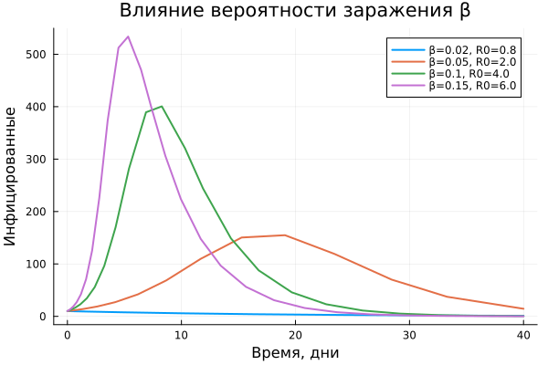
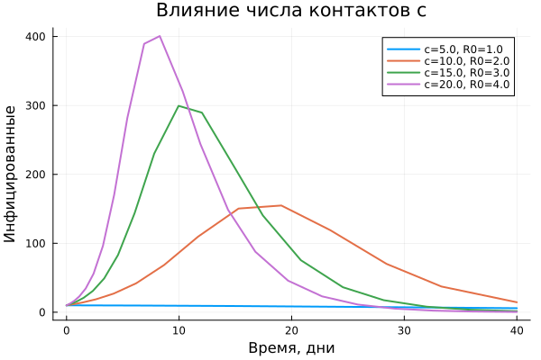
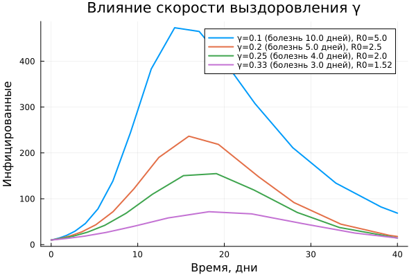
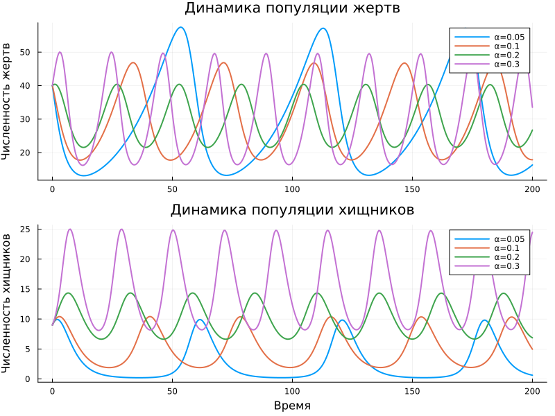
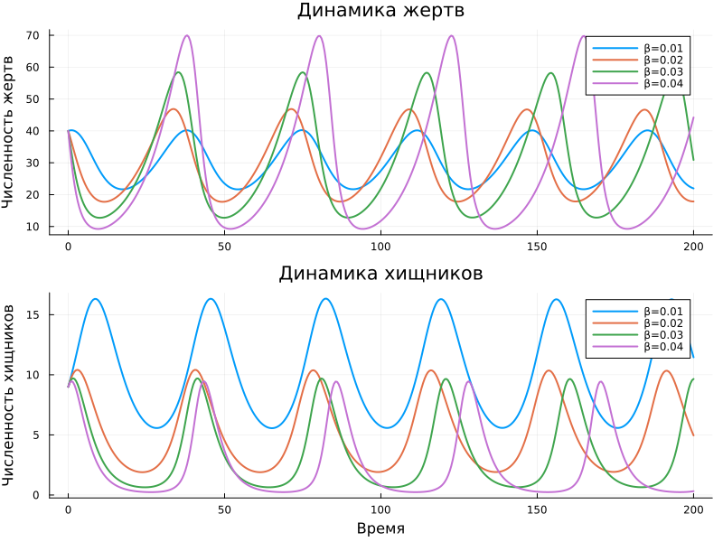
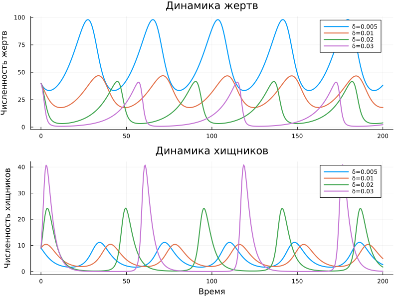
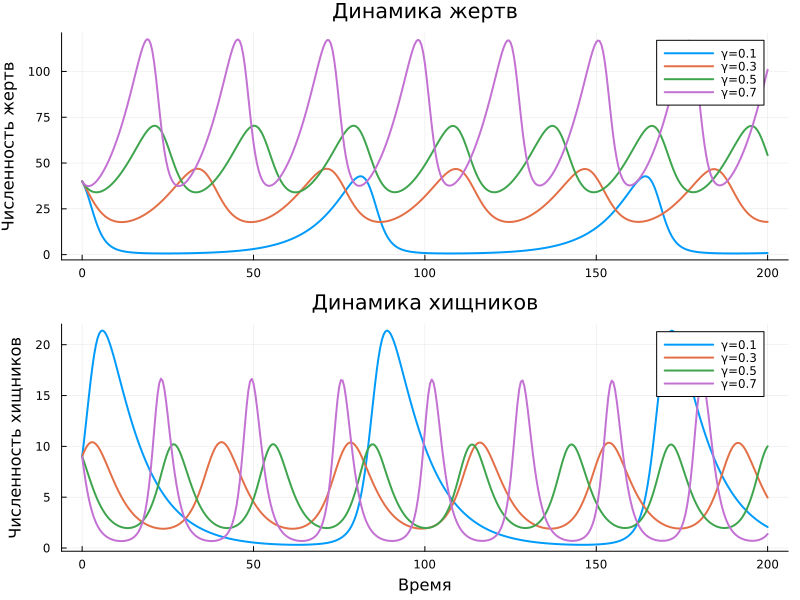

---
## Author
author:
  name: Дагделен Зейнап Реджеповна
  degrees: DSc
  orcid: 0000-0002-0877-7063
  email: 1132236052@rudn.ru
  affiliation:
    - name: Российский университет дружбы народов
      country: Российская Федерация
      postal-code: 117198
      city: Москва
      address: ул. Орджоникизде, д. 3
## Title
title: лабораторная работа 2
subtitle: Модели SIR и Лотки-Вольтерры
license: CC BY
date: today
date-format: "YYYY-MM-DD" # Example: 2025-09-06
---

# Информация

## Докладчик

:::::::::::::: {.columns align=center}
::: {.column width="70%"}

  * Дагделен Зейнап Реджеповна
  * студентка НКНбд-01-23
  * факультет физико-математических и естественных наук
  * Российский университет дружбы народов им. П. Лумумбы
  * [1132236052@rudn.ru](mailto:1132236052@pfur.ru)
  * <https://zrdagdelen.github.io>

:::
::: {.column width="30%"}

:::
::::::::::::::

# Вводная часть

## Цель

Изучить динамику нелинейных систем обыкновенных дифференциальных уравнений на примере, а также исследовать влияние параметров на характер решений, устойчивость и поведение систем во времени.

## Задача

- Выполнить моделирование системы SIR и проанализировать влияние параметров.
- Выполнить моделирование системы Лотки–Вольтерры и проанализировать влияние параметров.

# Выполнение лабораторной работы

## Создание нужных файлов SIR

Генерирую из литературного кода чистый код, jupyter notebook, документацию  quarto 

{#fig-001 width=65%}

## Анализ результатов. Параметр $\beta$  (вероятность передачи инфекции при контакте)

{#fig-002 width=65%}

## Анализ результатов. Параметр $c$  (среднее количество контактов человека в день)

{#fig-003 width=65%}

## Анализ результатов. Параметр $\gamma$  (скорость выздоровления)

{#fig-004 width=65%}

## Анализ результатов. Вывод.

1.  **Рост $\beta$ и $c$** (факторы передачи вируса) резко увеличивают $R_0$ и нагрузку на систему здравоохранения (пик).
2.  **Рост $\gamma$** (фактор выздоровления / изоляции) эффективно снижает \$R_0$, «сглаживает кривую» и уменьшает общее число переболевших.

## Создание нужных файлов LV

Генерирую из литературного кода чистый код, jupyter notebook, документацию  quarto 

{#fig-005 width=65%}

## Анализ результатов. Параметр $\alpha$ (рождаемость жертв)

{#fig-006 width=65%}

## Анализ результатов. Параметр $\beta$ (эффективность охоты)

{#fig-007 width=65%}

## Анализ результатов. Параметр $\delta$ (конверсия биомассы)

{#fig-008 width=65%}

## Анализ результатов. Параметр $\gamma$ (смертность хищников)

{#fig-009 width=65%}

## Анализ результатов. Вывод.

| Параметр | Эффект на жертв (x*) | Эффект на хищников (y*) | Биологический смысл |
|:---:|:---:|:---:|:---|
| **$\alpha$**| **Не меняется** | **Растет** | Больше еды → больше хищников |
| **$\beta$**| **Не меняется** | **Падает** | Переохот подрывает кормовую базу |
| **$\delta$**  | **Падает** | **Не меняется** | Эффективное питание требует меньше жертв |
| **$\gamma$** | **Растет** | **Не меняется** | Высокая смертность спасает жертв |

# Заключение

## Вывод

Изучила динамику нелинейных систем обыкновенных дифференциальных уравнений на примерах, а также исследовала влияние параметров.
