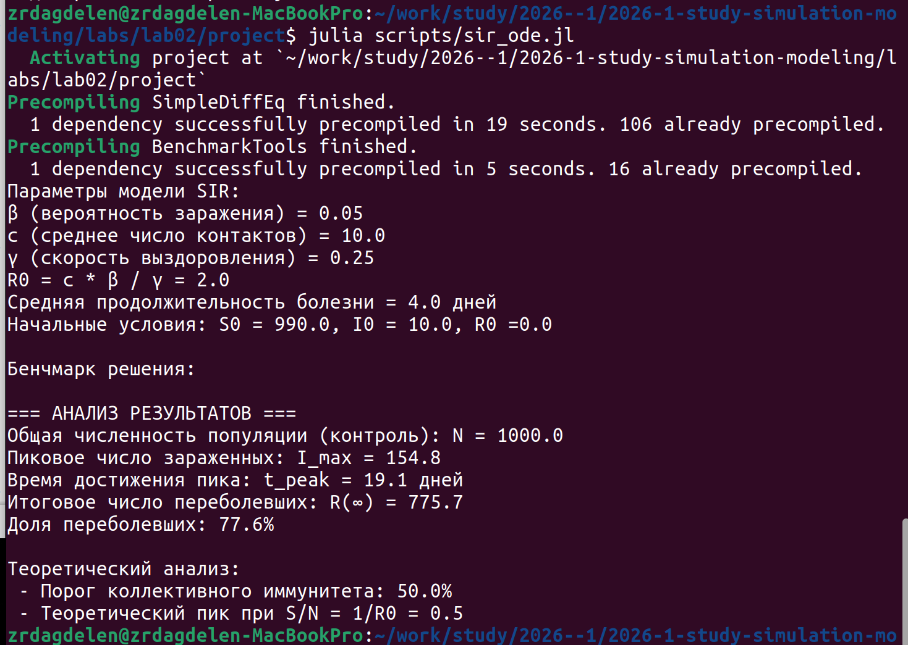
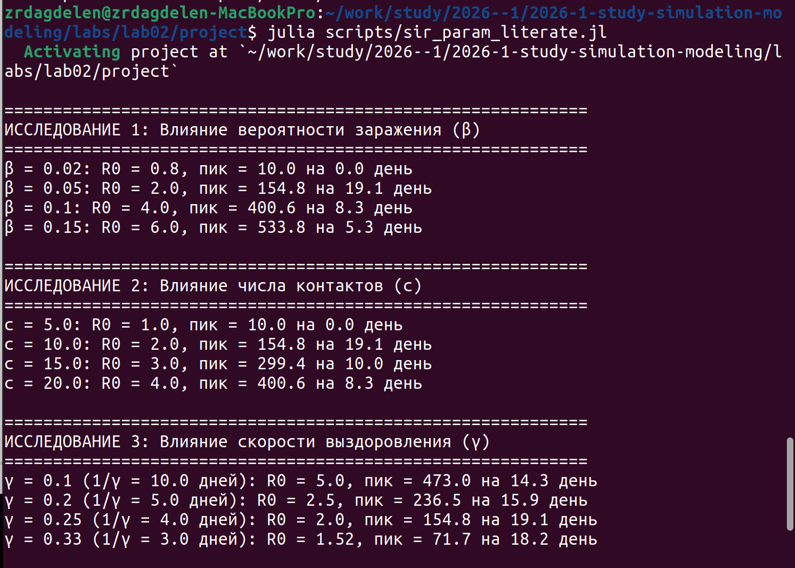
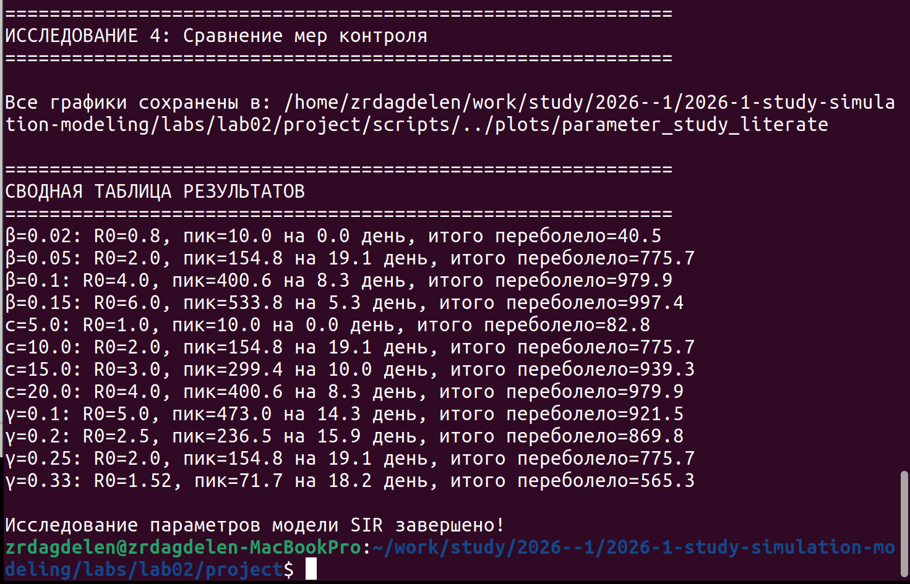
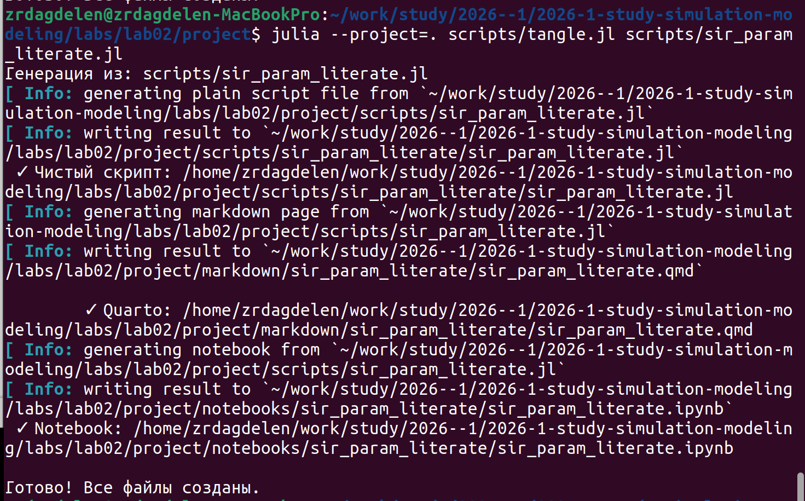
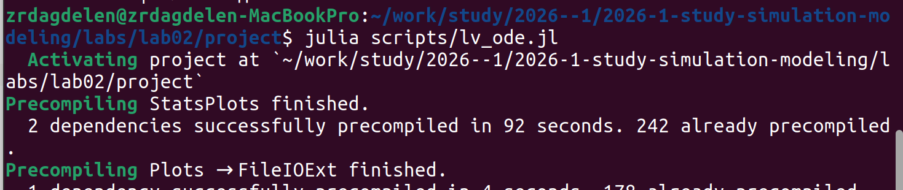
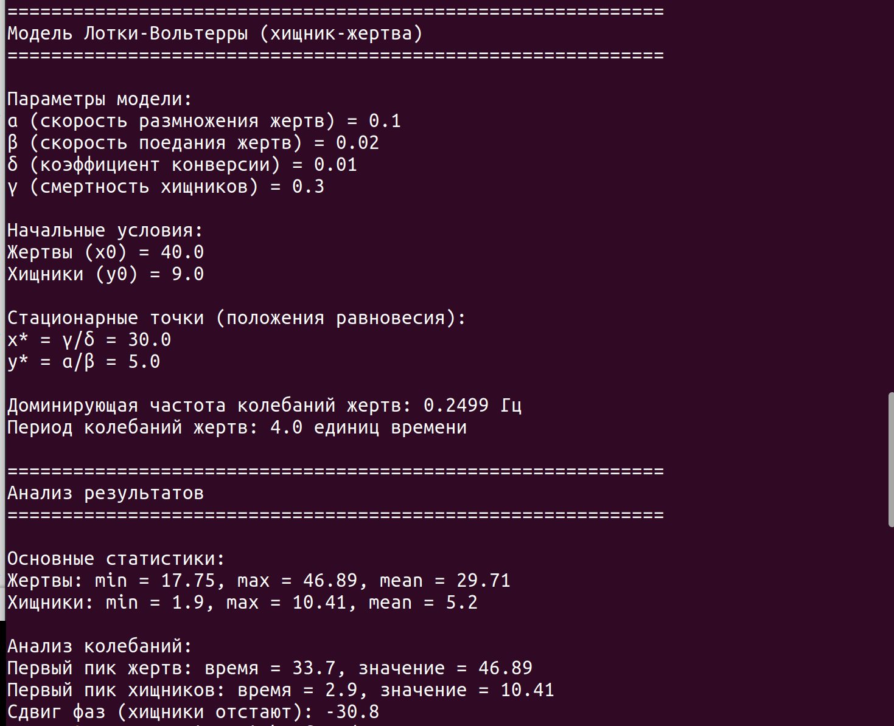
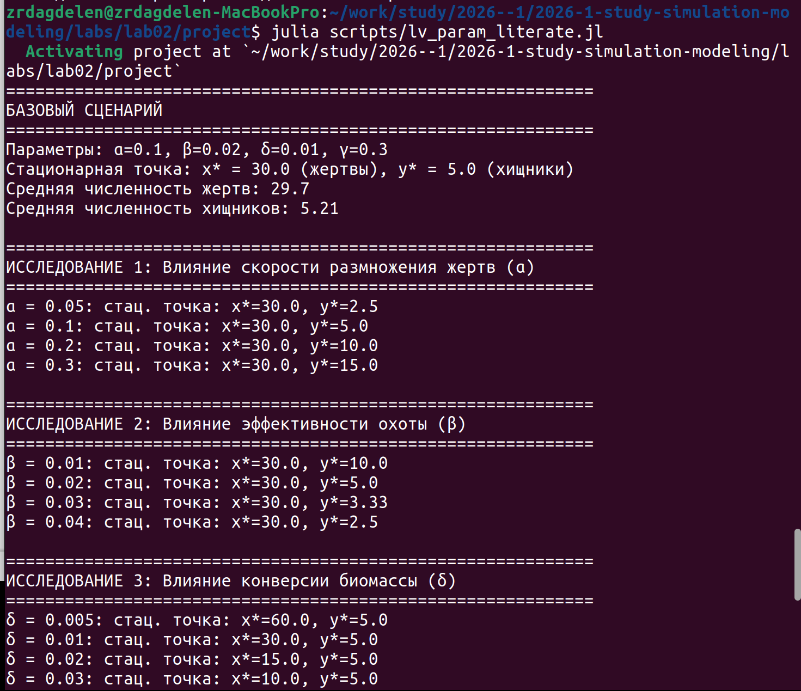
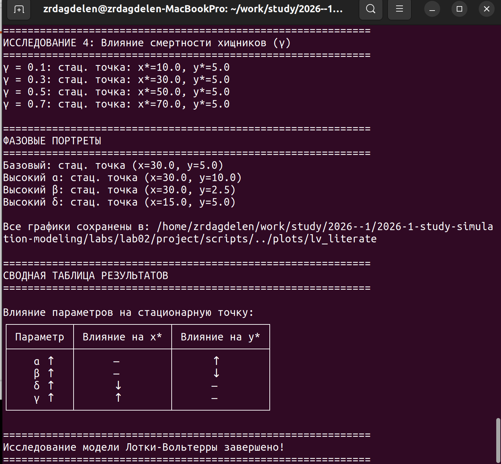
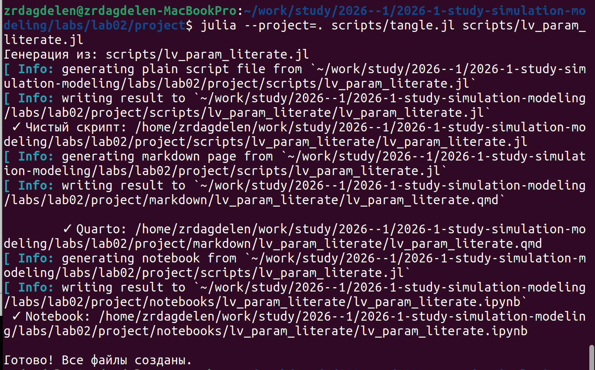

---
## Author
author:
  name: Дагделен Зейнап Реджеповна
  degrees: DSc
  orcid: 0000-0002-0877-7063
  email: 1132236052@rudn.ru
  affiliation:
    - name: Российский университет дружбы народов
      country: Российская Федерация
      postal-code: 117198
      city: Москва
      address: ул. Орджоникидзе, д. 3

## Title
title: "Лабораторная работа №2"
subtitle: "Модели SIR и Лотки-Вольтерры"
license: "CC BY"
---

# Цель работы

Изучить динамику нелинейных систем обыкновенных дифференциальных уравнений на примере:

* эпидемиологической модели SIR model,
* экологической модели Lotka–Volterra equations,

а также исследовать влияние параметров на характер решений, устойчивость и поведение систем во времени.


# Задание

1. Создать рабочий каталог проекта.
2. Установить необходимые пакеты Julia.
3. Выполнить моделирование системы SIR и проанализировать влияние параметров.
4. Выполнить моделирование системы Лотки–Вольтерры и проанализировать влияние параметров.

---

# Теоретическое введение

## Модель SIR

Модель SIR model описывает распространение инфекционного заболевания в замкнутой популяции.

Популяция делится на три группы:

* $S$ — восприимчивые (Susceptible),
* $I$ — инфицированные (Infectious),
* $R$ — выздоровевшие (Recovered).

Система уравнений:

$$
\frac{dS}{dt} = -\beta c \frac{SI}{N}
$$

$$
\frac{dI}{dt} = \beta c \frac{SI}{N} - \gamma I
$$

$$
\frac{dR}{dt} = \gamma I
$$

Ключевой параметр модели — базовое репродуктивное число:

$$
R_0 = \frac{\beta c}{\gamma}
$$

* Если ( $R_0$ > 1 ) — эпидемия развивается.
* Если ( $R_0$ < 1 ) — эпидемия затухает.

Модель позволяет оценить:

* скорость распространения инфекции,
* пик заболеваемости,
* порог коллективного иммунитета.

---

## Модель Лотки–Вольтерры

Модель Lotka–Volterra equations описывает взаимодействие двух популяций: жертв и хищников.

Система уравнений:

$$
\frac{dx}{dt} = \alpha x - \beta xy
$$

$$
\frac{dy}{dt} = \delta xy - \gamma y
$$

где:

* $x$ — численность жертв,
* $y$ — численность хищников,
* $\alpha$ — естественный рост жертв,
* $\beta$ — интенсивность поедания,
* $\delta$ — эффективность преобразования пищи,
* $\gamma$ — смертность хищников.

Модель демонстрирует:

* циклические колебания численности,
* фазовый сдвиг между популяциями,
* наличие стационарной точки равновесия.


# Выполнение лабораторной работы

Создала рабочий каталог для кода. Устанавливаю необходимые пакеты с помощью:

```julia
using Pkg
Pkg.activate(".")  # Активируем текущую папку как проект
Pkg.add(["DifferentialEquations", "DrWatson",
	 "DataFrames", "StatsPlots", "Plots",
	 "LaTeXStrings", "BenchmarkTools", "SimpleDiffEq", 
	 "Tables", "FFTW", "Statistics"])
```

Далее копирую предложенный код в файл sir_ode.jl и выполняю его ([рис. @fig-001])

{#fig-001 width=70%}

Играюсь с параметрами, чтобы посмотреть на их влияние, пишу код для этого и преобразовываю этот код в литературный стиль, выполняю полученный литературный код ([рис. @fig-002], [рис. @fig-003]) и с помощью предоставленноего в предыдущей лабораторной кода (tangle.jl) генерирую из него чистый код, jupyter notebook, документацию  quarto ([рис. @fig-004])

{#fig-002 width=70%}

{#fig-003 width=70%}

{#fig-004 width=70%}

Далее копирую предложенный код в файл lv_ode.jl и выполняю его ([рис. @fig-005], [рис. @fig-006])

{#fig-005 width=70%}

{#fig-006 width=70%}

Играюсь с параметрами, чтобы посмотреть на их влияние, пишу код для этого и преобразовываю этот код в литературный стиль, выполняю полученный литературный код ([рис. @fig-007], [рис. @fig-008]) и с помощью предоставленноего в предыдущей лабораторной кода (tangle.jl) генерирую из него чистый код, jupyter notebook, документацию  quarto ([рис. @fig-009])

{#fig-007 width=70%}

{#fig-008 width=70%}

{#fig-009 width=70%}

Код, подробный анализ и графики предоставленыы ниже.





# Выводы

Изучила динамику нелинейных систем обыкновенных дифференциальных уравнений на примерах, а также исследовала влияние параметров.

# Список литературы{.unnumbered}

[Лабораторная работа 2](https://esystem.rudn.ru/pluginfile.php/3094247/mod_resource/content/1/simulation-modeling-lab.pdf#chapter.2)

[Модель SIR](https://sawiki.cs.msu.ru/index.php/%D0%9C%D0%B0%D1%82%D0%B5%D0%BC%D0%B0%D1%82%D0%B8%D1%87%D0%B5%D1%81%D0%BA%D0%B0%D1%8F_%D0%BC%D0%BE%D0%B4%D0%B5%D0%BB%D1%8C_%D1%80%D0%B0%D1%81%D0%BF%D1%80%D0%BE%D1%81%D1%82%D1%80%D0%B0%D0%BD%D0%B5%D0%BD%D0%B8%D1%8F_%D1%8D%D0%BF%D0%B8%D0%B4%D0%B5%D0%BC%D0%B8%D0%B9)

[Модель Лотки-Вольтерры](https://www.google.com/url?sa=t&source=web&rct=j&opi=89978449&url=https://sawiki.cs.msu.ru/index.php/%25D0%25A1%25D0%25B8%25D1%2581%25D1%2582%25D0%25B5%25D0%25BC%25D0%25B0_%25D0%259B%25D0%25BE%25D1%2582%25D0%25BA%25D0%25B8-%25D0%2592%25D0%25BE%25D0%25BB%25D1%258C%25D1%2582%25D0%25B5%25D1%2580%25D1%2580%25D1%258B._%25D0%259F%25D1%2580%25D0%25B8%25D0%25BD%25D1%2586%25D0%25B8%25D0%25BF_%25D0%2592%25D0%25BE%25D0%25BB%25D1%258C%25D1%2582%25D0%25B5%25D1%2580%25D1%2580%25D1%258B&ved=2ahUKEwjSpI2umIGTAxUlDRAIHSCuBsgQFnoECCQQAQ&usg=AOvVaw0TBLhjuwYrjpyzyfsTl4_2)

::: {#refs}
:::
