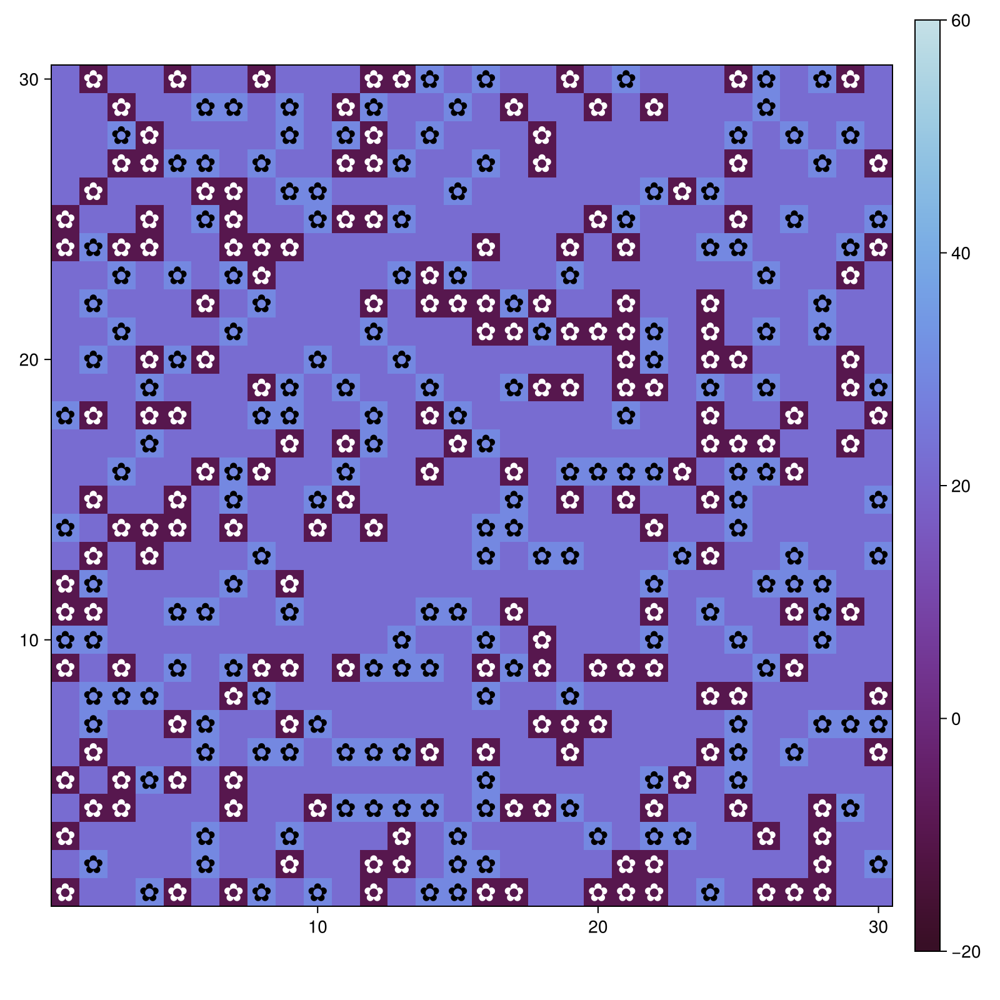
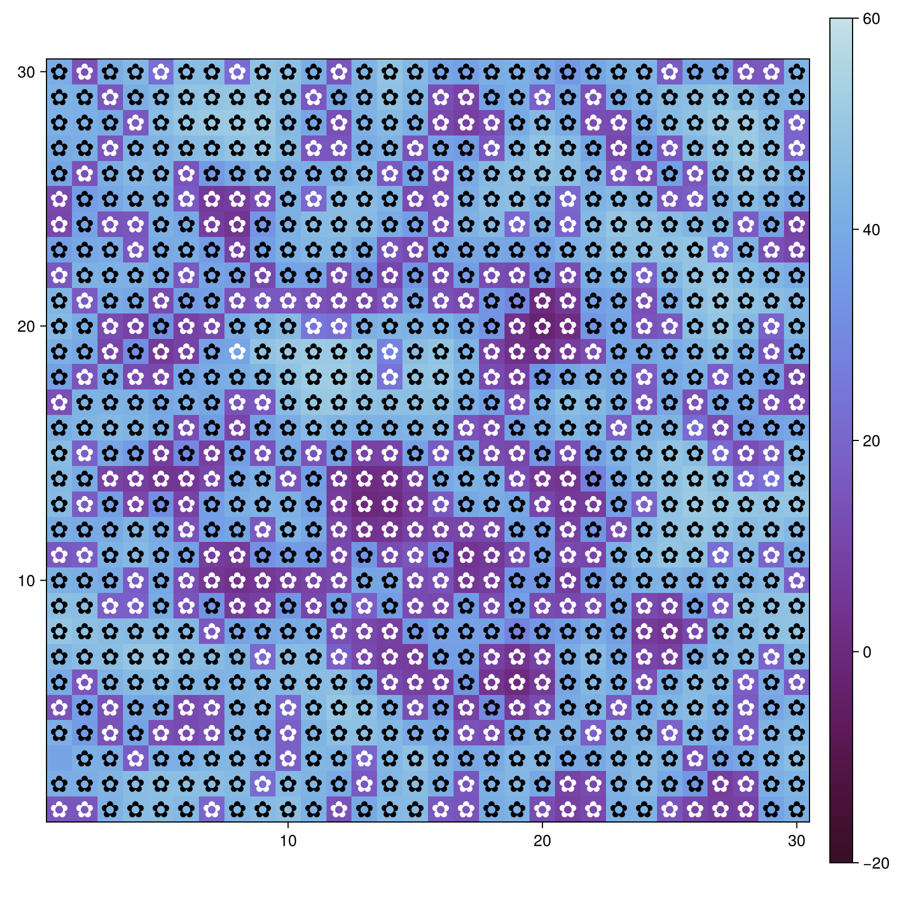
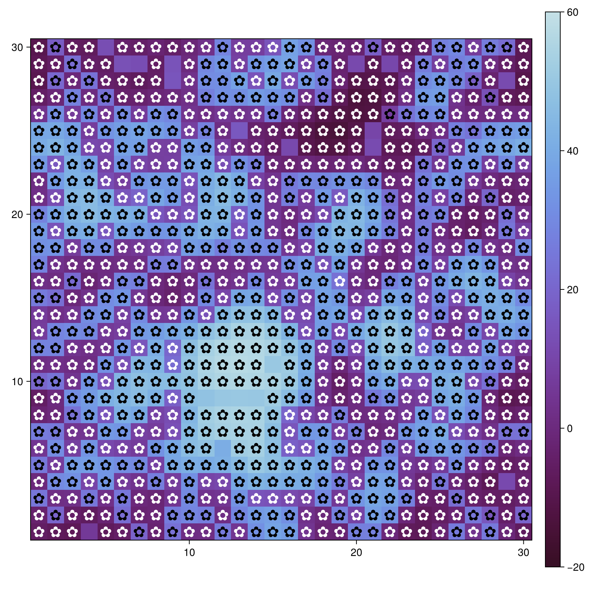
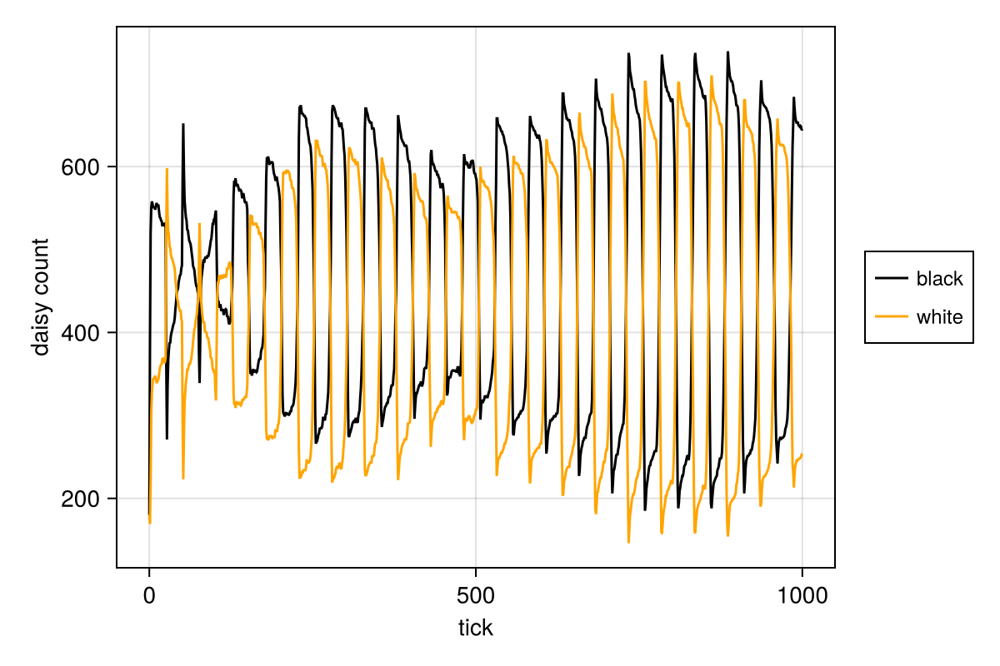
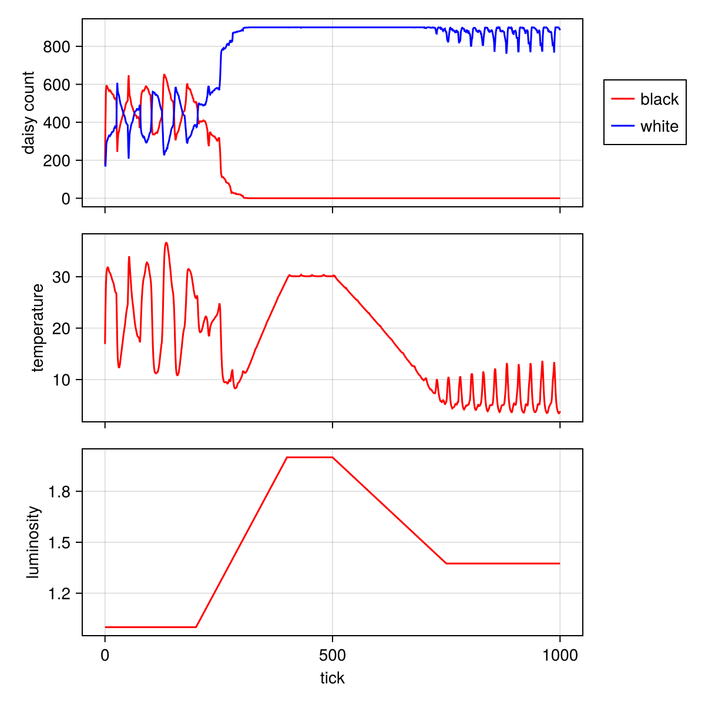

---
## Author
author:
  name: Дагделен Зейнап Реджеповна
  degrees: DSc
  orcid: 0000-0002-0877-7063
  email: 1132236052@rudn.ru
  affiliation:
    - name: Российский университет дружбы народов
      country: Российская Федерация
      postal-code: 117198
      city: Москва
      address: ул. Орджоникизде, д. 3
## Title
title: Лабораторная работа 3
subtitle: Агентное моделирование на примере модели Daisyworld в Julia
license: CC BY
date: today
date-format: "YYYY-MM-DD" # Example: 2025-09-06
---

# Информация

## Докладчик

:::::::::::::: {.columns align=center}
::: {.column width="70%"}

  * Дагделен Зейнап Реджеповна
  * студентка НКНбд-01-23
  * факультет физико-математических и естественных наук
  * Российский университет дружбы народов им. П. Лумумбы
  * [1132236052@rudn.ru](mailto:1132236052@pfur.ru)
  * <https://zrdagdelen.github.io>

:::
::: {.column width="30%"}

:::
::::::::::::::

# Вводная часть

## Цель

- Изучение агентного подхода к имитационному моделированию (ABM) на классическом примере модели Daisyworld (Мир маргариток). 

## Задача

-  Выполнить предложенный код реализации модели Daisyworld и проанализировать результат.
- Провести параметрическое исследование модели.

# Выполнение лабораторной работы

## Генерация нужных файлов

Скачала необходимые пакеты, сгенерировала нужные файлы (jupyter notebook, чистый код и quarto)

## Анализ результатов. Начальное состояние модели (daisy_step001) 

{#fig-001 width=40%}

## Анализ результатов. Состояние после нескольких шагов симуляции(daisy_step005)

{#fig-002 width=40%}

## Анализ результатов. Состояние после длительной эволюции (daisy_step040)

{#fig-003 width=40%}

## Анализ результатов. Динамика количества ромашек (daisy_count)

{#fig-004 width=50%}

## Анализ результатов. Влияние солнечной светимости (daisy_luminosity)

{#fig-005 width=40%}

## Анализ файлов с параметрами

| Файл 		   | Входные параметры | Выходные данные | Что выявляет |
|------------------|-------------------|-----------------|-----------------|
| daisyworld__param.jl | `max_age`, `init_white` | Тепловые карты (3 временных среза) | Пространственную самоорганизацию |
| daisyworld-count__param.jl | `max_age`, `init_white` | Графики численности | Динамику конкуренции видов |
| daisyworld-luminosity__param.jl | `max_age`, `init_white` + сценарий `:ramp` | Комплексные графики | Регуляторную способность и гистерезис |

# Заключение

## Вывод

- Реализована агентная модель Daisyworld.

- Продемонстрирован эффект саморегуляции.

- Подтверждена гипотеза Геи.
