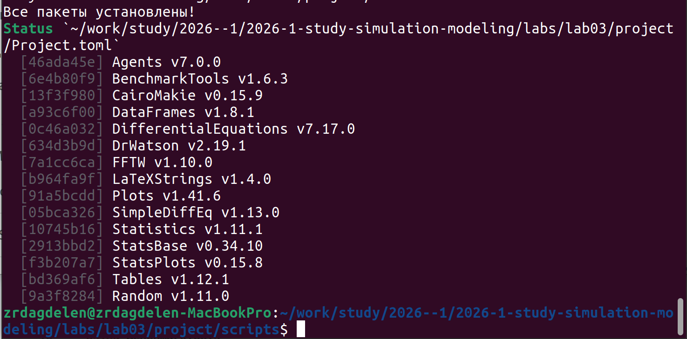
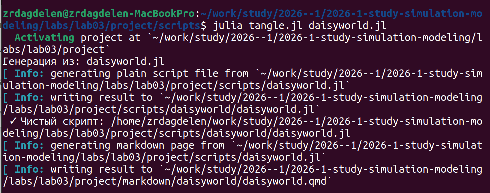
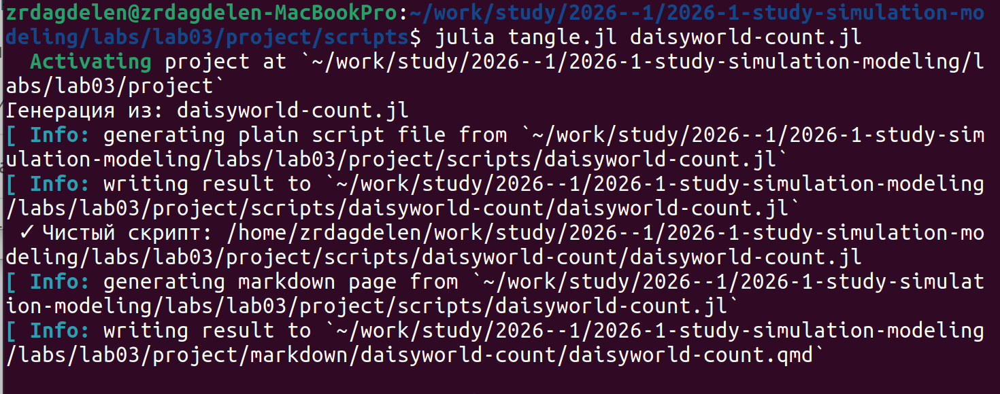
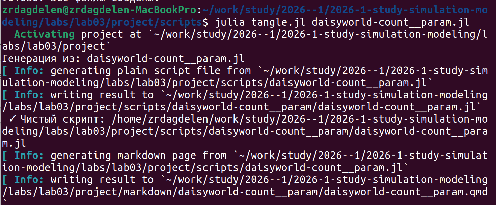
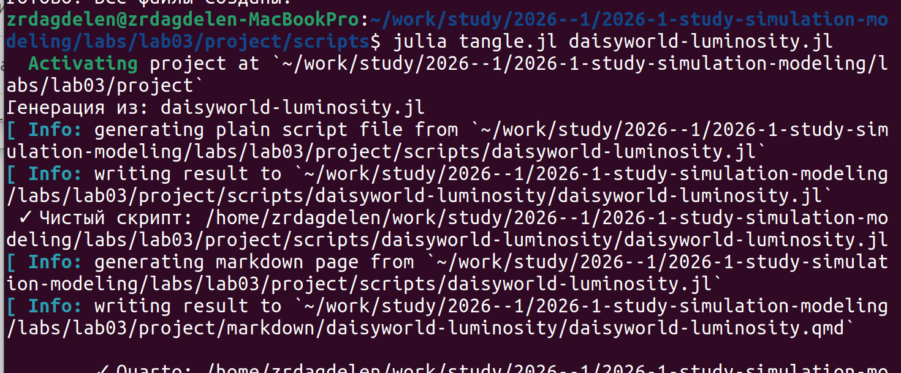
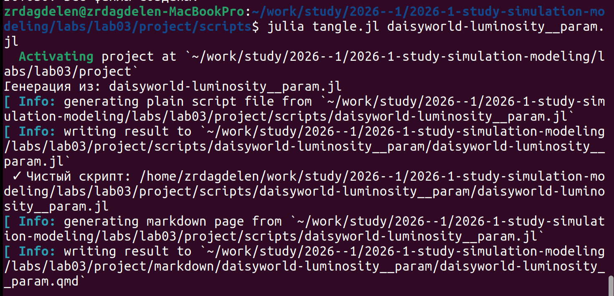
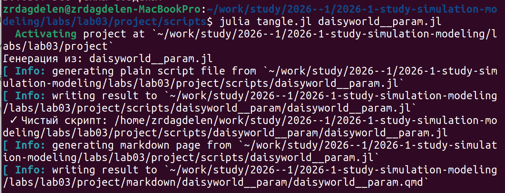

---
## Author
author:
  name: Дагделен Зейнап Реджеповна
  degrees: DSc
  orcid: 0000-0002-0877-7063
  email: 1132236052@rudn.ru
  affiliation:
    - name: Российский университет дружбы народов
      country: Российская Федерация
      postal-code: 117198
      city: Москва
      address: ул. Орджоникидзе, д. 3

## Title
title: "Лабораторная работа №3"
subtitle: "Агентное моделирование на примере модели Daisyworld в Julia"
license: "CC BY"
---

# Цель работы
Целью работы является изучение агентного подхода к имитационному моделированию (ABM) на классическом примере модели Daisyworld (Мир маргариток). Работа предполагает освоение основных принципов создания агентных моделей, их программную реализацию на языке Julia с использованием пакета `Agents.jl`, проведение вычислительных экспериментов, визуализацию и анализ полученных результатов, а также оформление кода в литературном стиле с последующей генерацией документации.

# Задание
1.  Создать рабочий каталог и установить необходимые пакеты Julia (`Agents.jl`, `DrWatson.jl`, `CairoMakie.jl`, `DataFrames.jl` и др.).
2.  Выполнить предложенный код реализации модели Daisyworld, последовательно запуская скрипты для базовой визуализации, анимации, построения графиков динамики популяций и анализа чувствительности при изменении параметров.
3.  Преобразовать исходный код в литературный стиль (Literate Programming), интегрируя код и текстовые пояснения.
4.  Сгенерировать из литературного кода:
    *   Чистый исполняемый код (`.jl`);
    *   Интерактивный Jupyter Notebook (`.ipynb`);
    *   Документацию в формате Quarto (`.qmd`).
5.  Выполнить код из сгенерированного Jupyter Notebook для проверки работоспособности.
6.  Провести параметрическое исследование модели.

# Теоретическое введение

## Агентное моделирование
Агентный подход (Agent-Based Modeling, ABM) — это метод имитационного моделирования, исследующий поведение децентрализованных систем. В отличие от моделей, оперирующих усредненными величинами, ABM фокусируется на индивидуальных, автономных единицах — **агентах**. Глобальное поведение системы возникает (**эмерджентность**) как результат локальных взаимодействий множества агентов между собой и с окружающей средой. Ключевые принципы ABM включают автономию агентов, их гетерогенность (разнообразие свойств) и локальность взаимодействий.

## Модель Daisyworld
Модель Daisyworld, предложенная Джеймсом Лавлоком и Эндрю Уотсоном, является классическим примером агентной модели, иллюстрирующим гипотезу Геи. Согласно этой гипотезе, биота (живые организмы) и окружающая среда взаимодействуют, формируя саморегулирующуюся систему, поддерживающую условия, пригодные для жизни.

В модели рассматривается планета, населенная только двумя видами маргариток: черными и белыми.

*  **Агенты:** Маргаритки двух типов, обладающие возрастом и различным альбедо (отражательной способностью). Черные маргаритки имеют низкое альбедо (поглощают тепло), белые — высокое (отражают тепло).
*  **Среда:** Двумерная клеточная сетка, каждая клетка которой характеризуется локальной температурой. Температура также диффундирует между соседними клетками.
*  **Взаимодействия:**
    *  Маргаритки влияют на среду: изменяют локальную температуру клетки в зависимости от своего альбедо.
    *  Среда влияет на маргаритки: температура клетки определяет вероятность размножения (прорастания семян) и гибели растений.
    *  Механизм обратной связи: при низкой температуре черные маргаритки, нагревая почву, создают более благоприятные условия для роста. При высокой температуре белые маргаритки, охлаждая почву, помогают выживанию. Это взаимодействие позволяет системе поддерживать стабильную температуру в широком диапазоне уровней солнечной радиации.

## Инструменты реализации
Для реализации модели используется язык программирования Julia и его пакет экосистемы `Agents.jl`, предоставляющий удобные структуры для создания агентов, определения пространства, сбора данных и визуализации.

# Выполнение лабораторной работы

## Работа с файлами

Устанавливаю необходимые пакеты ([рис. @fig-001]).

{#fig-001 width=70%}

Также создаю необходимые файлы и вставляю туда предоставленный в лабораторной работе код, создаю литературный код и генерирую из него чистый код, код jupyter notebook и чистый код ([рис. @fig-002], [рис. @fig-003],[рис. @fig-004], [рис. @fig-005], [рис. @fig-006], [рис. @fig-007])

{#fig-002 width=70%}

{#fig-003 width=70%}

{#fig-004 width=70%}

{#fig-005 width=70%}

{#fig-006 width=70%}

{#fig-007 width=70%}

Анализ результатов и код из файлов предоставлен ниже.

## Код и анализ daisyworld.gl



## Код и анализ daisyworld-count.jl



## Код и анализ daisyworld-luminosity.jl



## Код и анализ daisyworld__param.jl



## Код и анализ daisyworld-count__param.jl



## Код и анализ daisyworld-luminosity__param.jl



# Вывод

В ходе выполнения лабораторной работы была успешно реализована и исследована агентная модель Daisyworld. 

# Список литературы{.unnumbered}

[Лабораторная работ №3. Агентное моделирование](https://esystem.rudn.ru/pluginfile.php/3094247/mod_resource/content/2/simulation-modeling-lab.pdf#chapter.3)

::: {#refs}
:::
