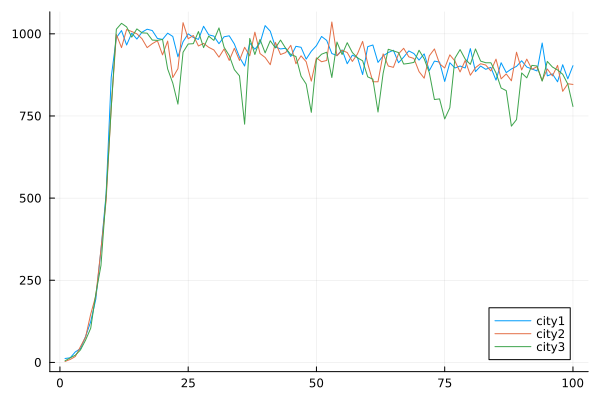
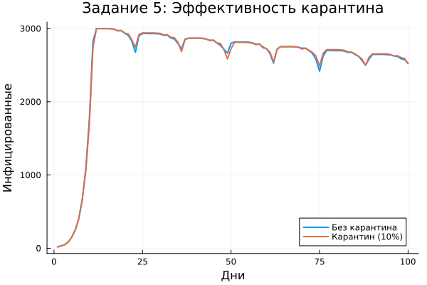

---
## Author
author:
  name: Дагделен Зейнап Реджеповна
  degrees: DSc
  orcid: 0000-0002-0877-7063
  email: 1132236052@rudn.ru
  affiliation:
    - name: Российский университет дружбы народов
      country: Российская Федерация
      postal-code: 117198
      city: Москва
      address: ул. Орджоникизде, д. 3
## Title
title: Лабораторная работа 4
subtitle: Реализация основных моделей в агентном подходе (на примере эпидемиологической модели SIR)
license: CC BY
date: today
date-format: "YYYY-MM-DD" # Example: 2025-09-06
---

# Информация

## Докладчик

:::::::::::::: {.columns align=center}
::: {.column width="70%"}

  * Дагделен Зейнап Реджеповна
  * студентка НКНбд-01-23
  * факультет физико-математических и естественных наук
  * Российский университет дружбы народов им. П. Лумумбы
  * [1132236052@rudn.ru](mailto:1132236052@pfur.ru)
  * <https://zrdagdelen.github.io>

:::
::: {.column width="30%"}

:::
::::::::::::::

# Вводная часть

## Цель

Освоить методы агентного моделирования на примере эпидемиологической модели SIR. Реализовать модель с учетом пространственной структуры (метапопуляционная модель), стохастичности и индивидуальных характеристик агентов. Провести параметрические исследования, оценить влияние миграции и мер контроля на динамику эпидемии.

## Задача

1. Реализовать агентную модель SIR в Julia.
2. Провести эксперименты.
3. Выполнить допзадания.

## Модель SIR

- **S** — восприимчивые
- **I** — инфицированные  
- **R** — выздоровевшие

**Динамика:**

- S → I → R

**Параметры:**

- $\beta$ — заразность
- $\gamma$ — выздоровление

**$R_0 = \beta / \gamma$** — порог эпидемии

# Выполнение лабораторной работы

## Генерация нужных файлов

Скачала необходимые пакеты, сгенерировала нужные файлы (jupyter notebook, чистый код и quarto)

## Анализ результатов. Базовое поведение модели

{#fig-001 width=50%}

## Анализ результатов. Разница между городами

{#fig-002 width=50%}

## Анализ результатов. Эффективность мер (карантин)

{#fig-003 width=50%}

# Заключение

## Вывод

В ходе работы реализована агентная модель SIR с пространственной структурой. 

Агентный подход позволяет учитывать индивидуальные характеристики и пространственные взаимодействия, что дает более реалистичную динамику по сравнению с классической ODU-моделью.
