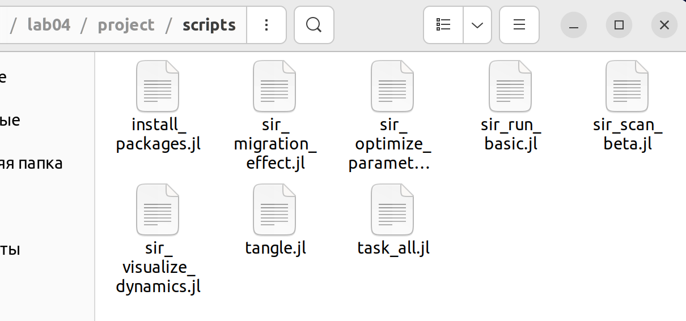
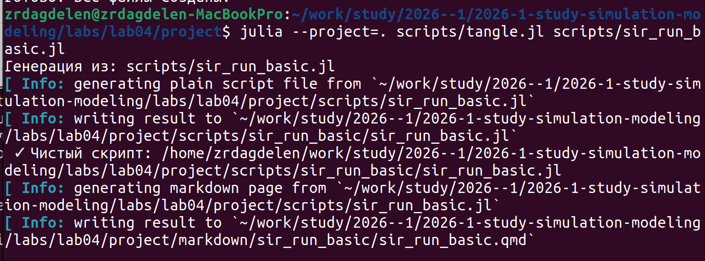
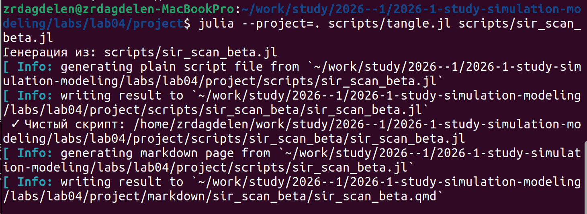
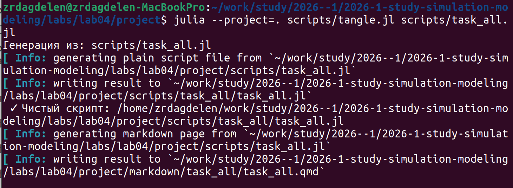

---
## Author
author:
  name: Дагделен Зейнап Реджеповна
  degrees: DSc
  orcid: 0000-0002-0877-7063
  email: 1132236052@rudn.ru
  affiliation:
    - name: Российский университет дружбы народов
      country: Российская Федерация
      postal-code: 117198
      city: Москва
      address: ул. Орджоникидзе, д. 3

## Title
title: "Лабораторная работа №4"
subtitle: "Реализация основных моделей в агентном подходе (на примере эпидемиологической модели SIR)"
license: "CC BY"
---

# Цель работы

Освоить методы агентного моделирования на примере эпидемиологической модели SIR. Реализовать модель с учетом пространственной структуры (метапопуляционная модель), стохастичности и индивидуальных характеристик агентов. Провести параметрические исследования, оценить влияние миграции и мер контроля на динамику эпидемии.

# Задание

1. Реализовать агентную модель SIR в среде Julia с использованием пакета `Agents.jl`, учитывающую:
   - состояния агентов (`S`, `I`, `R`);
   - пространственную структуру (несколько локаций);
   - стохастические процессы передачи инфекции и миграции;
   - параметры заразности, выявления, летальности и повторного заражения.

2. Провести вычислительные эксперименты:
   - **базовый** — получить динамику численности групп;
   - **сканирование β** — оценить влияние заразности на пик эпидемии и смертность;
   - **исследование миграции** — определить влияние перемещений между локациями на время и высоту пика;
   - **оптимизацию** — найти параметры, минимизирующие пик заболеваемости и долю умерших.

3. Выполнить дополнительные задания (расчет $R_0$, анализ порога эпидемии, модификация модели).

4. Оформить отчет с листингами кода, графиками и анализом результатов.


# Теоретическое введение

## Классическая модель SIR

Модель SIR (Susceptible-Infected-Recovered), предложенная Кермаком и Маккендриком в 1927 году, является одной из фундаментальных моделей математической эпидемиологии. Она описывает распространение инфекционного заболевания в популяции, разделяя её на три группы:

*   **S (Susceptible)** — восприимчивые к заболеванию индивиды;
*   **I (Infectious)** — инфицированные индивиды, способные заражать восприимчивых;
*   **R (Recovered)** — выздоровевшие (или умершие) индивиды, обладающие иммунитетом и не участвующие в распространении инфекции.

Динамика модели описывается системой обыкновенных дифференциальных уравнений (ОДУ):

$$
\begin{aligned}
\frac{dS}{dt} &= -\frac{\beta S I}{N}, \\
\frac{dI}{dt} &= \frac{\beta S I}{N} - \gamma I, \\
\frac{dR}{dt} &= \gamma I,
\end{aligned}
$$

где:

*   $N = S + I + R$ — общая численность популяции;
*   $\beta$ — коэффициент передачи инфекции (скорость заражения);
*   $\gamma$ — скорость выздоровления ($1/\gamma$ — средняя длительность заболевания).

Ключевой характеристикой модели является базовое репродуктивное число $R_0 = \beta / \gamma$, определяющее способность инфекции к распространению. При $R_0 > 1$ возникает эпидемия, при $R_0 < 1$ инфекция затухает.

## Ограничения классического подхода

Несмотря на широкое применение, модель на ОДУ имеет ряд существенных ограничений:

*   **Однородность популяции:** все индивиды считаются одинаковыми (одинаковая восприимчивость, контактность).
*   **Отсутствие пространственной структуры:** предполагается полное и мгновенное перемешивание всех индивидов.
*   **Детерминированность:** не учитываются случайные флуктуации, особенно важные при малой численности популяции.
*   **Непрерывность:** численность групп рассматривается как непрерывная величина, что не вполне корректно для малых выборок.

## Преимущества агентного подхода

Агентное моделирование (Agent-Based Modeling, ABM) позволяет преодолеть указанные ограничения. Вместо оперирования средними величинами, каждый индивид (агент) моделируется отдельно. Это дает возможность:

*   Учитывать **гетерогенность** агентов (различная восприимчивость, мобильность, социальное поведение).
*   Моделировать **пространственную структуру** и локальные взаимодействия (например, в пределах одного города или социальной сети).
*   Учитывать **стохастический характер** процессов, что позволяет оценивать вероятностные исходы эпидемии.
*   Внедрять сложные **адаптивные стратегии** поведения (например, карантин, самоизоляцию) на основе локальной информации.

В данной работе агентная модель SIR реализуется с использованием пакета `Agents.jl` в среде Julia. Агенты размещаются на графе, где узлы представляют локации (города), а ребра — возможные перемещения. Процессы передачи инфекции и миграции реализованы как стохастические события, что позволяет более реалистично моделировать динамику эпидемии в пространственно-распределенной популяции.


# Выполнение лабораторной работы

Создала необходимые файлы, куда скопировала весь код, предоставленный в лабораторной работе ([рис. @fig-001]).

{#fig-001 width=70%}

Запустила их всех, сначала пробежав ```install_packages.jl```, установив необходимые библиотеки.

Далее создала литературный код для нескольких основных файлов, а также для ```task_all.jl```, в котором были решены все дополнительные задания из лабораторной. После скомпилировала чистый код, jupiter notebook и quarto с помощью файла с кодом ```tangle.jl``` ([рис. @fig-002]), ([рис. @fig-003]), ([рис. @fig-004]).

{#fig-002 width=70%}

{#fig-003 width=70%}

{#fig-004 width=70%}

Кад из файлов и анализ результатов предоставлен ниже.







# Выводы

В ходе работы реализована агентная модель SIR с пространственной структурой и стохастическими процессами.

**Основные результаты:**

- Базовый эксперимент подтвердил корректность модели: динамика $S(t)$, $I(t)$, $R(t)$ соответствует классической SIR-модели.
- Сканирование коэффициента заразности выявило пороговое значение $\beta$, при превышении которого возникает эпидемия; с ростом $\beta$ увеличиваются пик заболеваемости и смертность.
- Увеличение интенсивности миграции приводит к более раннему и более высокому пику инфекции за счет ускоренного распространения между локациями.
- Многокритериальная оптимизация позволила найти компромиссные параметры, одновременно снижающие пик заболеваемости и долю умерших.

Агентный подход продемонстрировал преимущества перед детерминированными моделями: возможность учета гетерогенности популяции, пространственной структуры и стохастичности, что позволяет получать более реалистичные прогнозы.

# Список литературы{.unnumbered}

- [Лабораторная №4](https://esystem.rudn.ru/pluginfile.php/3094247/mod_resource/content/3/simulation-modeling-lab.pdf#chapter.4)

::: {#refs}
:::
