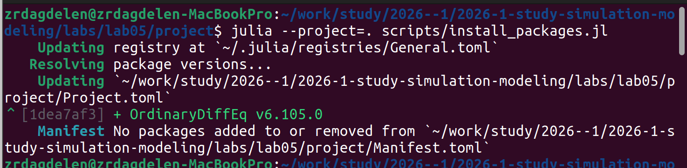
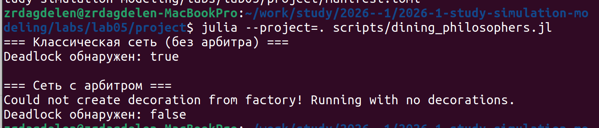
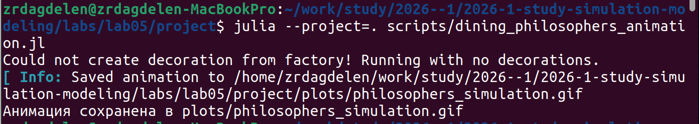
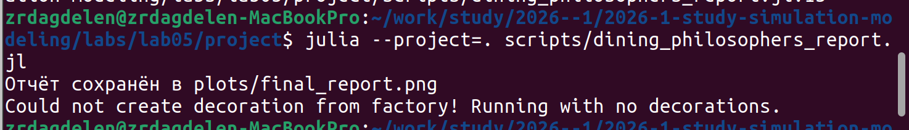
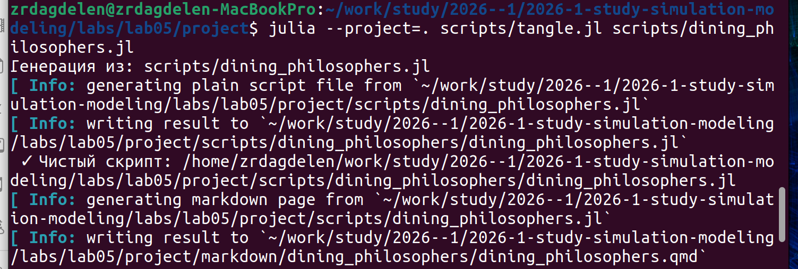
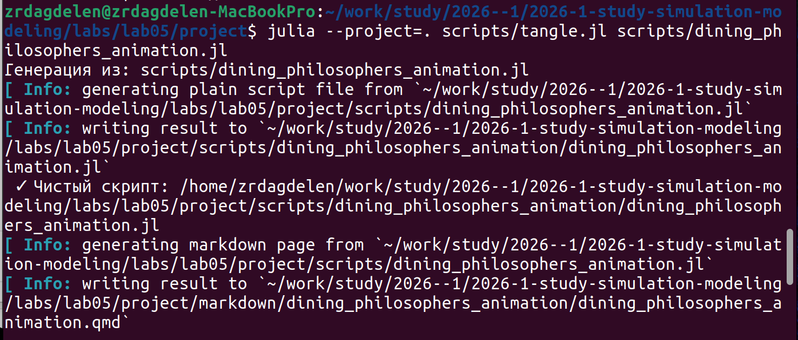
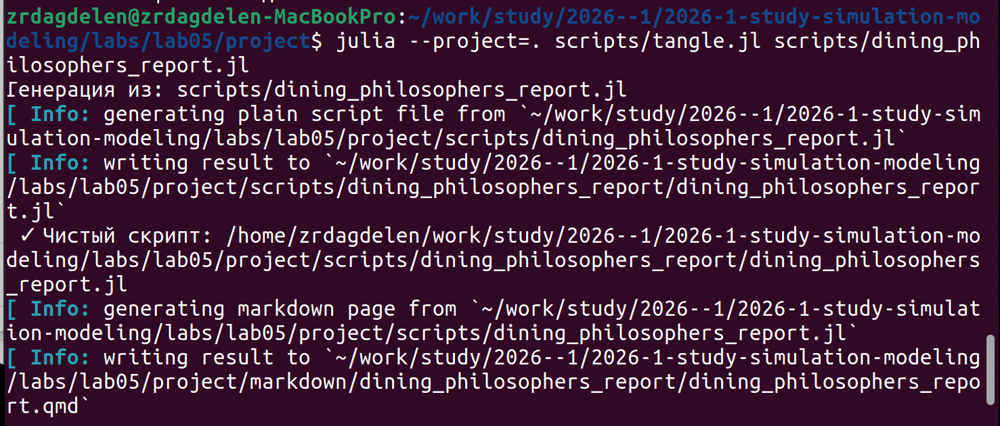

---
## Author
author:
  name: Дагделен Зейнап Реджеповна
  degrees: DSc
  orcid: 0000-0002-0877-7063
  email: 1132236052@rudn.ru
  affiliation:
    - name: Российский университет дружбы народов
      country: Российская Федерация
      postal-code: 117198
      city: Москва
      address: ул. Орджоникидзе, д. 3

## Title
title: "Лабораторная работа №5"
subtitle: "Моделирование параллельных систем с помощью сетей Петри на примере задачи об обедающих философах"
license: "CC BY"
---

# Цель работы

1. Построить сеть Петри для задачи об обедающих философах.
2. Обнаружить deadlock в классической модели.
3. Модифицировать сеть введением арбитра для предотвращения deadlock.
4. Провести стохастическое моделирование с помощью алгоритма Гиллеспи.
5. Сравнить поведение двух моделей и визуализировать результаты.


# Теоретическое введение

## Сети Петри

Сеть Петри — математический аппарат для моделирования дискретных систем с параллелизмом и синхронизацией. Формально определяется как четвёрка:

$$
N = (P, T, F, M_0),
$$

где:

- $P$ — множество позиций (состояния, ресурсы);
- $T$ — множество переходов (события, действия);
- $F$ — множество дуг между позициями и переходами;
- $M_0$ — начальная маркировка (распределение фишек).

Графически позиции обозначаются кругами, переходы — прямоугольниками. Фишки внутри позиций показывают текущее состояние системы. Переход срабатывает, если во всех входных позициях достаточно фишек. При срабатывании фишки изымаются из входных позиций и добавляются в выходные.

**Ключевые свойства сетей Петри:**

- **Ограниченность** — фишек в позиции не больше заданного предела.
- **Активность** — отсутствие тупиков, каждый переход может сработать.
- **Достижимость** — возможность попасть из начального состояния в целевое.

## Задача об обедающих философах

Сформулирована Эдсгером Дейкстрой в 1965 году для иллюстрации проблем синхронизации в параллельных системах.

**Постановка:**

- N философов сидят за круглым столом.
- Между соседями лежит одна вилка (всего N вилок).
- Философ может думать, быть голодным или есть.
- Чтобы поесть, нужны две вилки — слева и справа.

**Проблема deadlock:**

Если каждый философ возьмёт левую вилку и будет ждать правую, все заблокируются — система замирает.

**Решение с арбитром:**

Вводится дополнительный ресурс (арбитр), ограничивающий число одновременно едящих философов до N-1, что предотвращает deadlock.

## Алгоритм Гиллеспи

Стохастический метод моделирования, где время до следующего события и выбор перехода определяются случайным образом на основе интенсивностей переходов.

# Выполнение лабораторной работы

Создала необходимые файлы, куда скопировала весь код, предоставленный в лабораторной работе.

Запустила их всех, сначала пробежав ```install_packages.jl```, установив необходимые библиотеки ([рис. @fig-001], [рис. @fig-002], [рис. @fig-003], [рис. @fig-004]).

{#fig-001 width=70%}

{#fig-002 width=70%}

{#fig-003 width=70%}

{#fig-004 width=70%}

Далее создала литературный код для всех основных файлов. После скомпилировала чистый код, jupiter notebook и quarto с помощью файла с кодом ```tangle.jl``` ([рис. @fig-005]), ([рис. @fig-006]), ([рис. @fig-007]).

{#fig-005 width=70%}

{#fig-006 width=70%}

{#fig-007 width=70%}

Кад из файлов и анализ результатов предоставлен ниже.







# Вывод

Сети Петри являются удобным и наглядным инструментом для моделирования параллельных систем. Задача об обедающих философах наглядно демонстрирует проблему deadlock, а модификация с арбитром показывает эффективный способ её решения. Стохастическое моделирование позволяет исследовать динамику системы в непрерывном времени.

# Список литературы{.unnumbered}

- [Лабораторная №5](https://esystem.rudn.ru/pluginfile.php/3094247/mod_resource/content/3/simulation-modeling-lab.pdf#chapter.5)

::: {#refs}
:::
