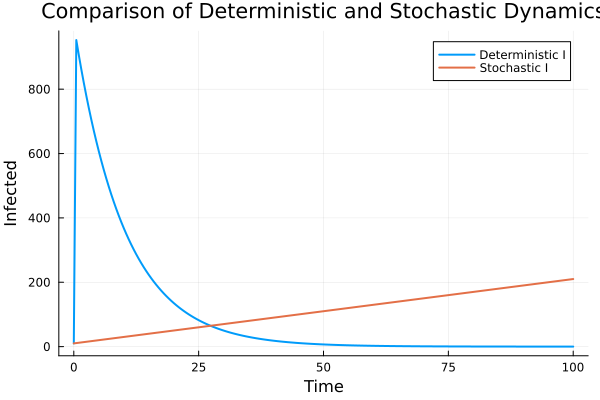
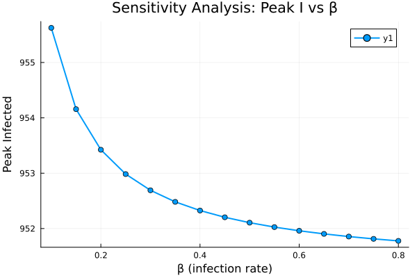

---
## Author
author:
  name: Дагделен Зейнап Реджеповна
  degrees: DSc
  orcid: 0000-0002-0877-7063
  email: 1132236052@rudn.ru
  affiliation:
    - name: Российский университет дружбы народов
      country: Российская Федерация
      postal-code: 117198
      city: Москва
      address: ул. Орджоникизде, д. 3
## Title
title: Лабораторная работа 6
subtitle: Реализация основных моделей в подходе сетей Петри
license: CC BY
date: today
date-format: "YYYY-MM-DD" # Example: 2025-09-06
---

# Информация

## Докладчик

:::::::::::::: {.columns align=center}
::: {.column width="70%"}

  * Дагделен Зейнап Реджеповна
  * студентка НКНбд-01-23
  * факультет физико-математических и естественных наук
  * Российский университет дружбы народов им. П. Лумумбы
  * [1132236052@rudn.ru](mailto:1132236052@pfur.ru)
  * <https://zrdagdelen.github.io>

:::
::: {.column width="30%"}

:::
::::::::::::::

# Вводная часть

## Цель

Освоить моделирование эпидемии SIR с помощью сетей Петри в Julia, реализовать детерминированный и стохастический подходы, провести анализ чувствительности модели.

## Краткое теоретическое введение. Модель SIR

**Модель SIR** описывает распространение инфекции в популяции:

- **S** (Susceptible) — восприимчивые
- **I** (Infectious) — инфицированные
- **R** (Recovered) — выздоровевшие

## Краткое теоретическое введение. Процессы

**Процессы:**
- Заражение: $S + I \xrightarrow{\beta} I + I$
- Выздоровление: $I \xrightarrow{\gamma} R$

**Сети Петри** — графовая модель с позициями (S, I, R), переходами (infection, recovery) и фишками. Позволяет строить как детерминированные ОДУ (закон действующих масс), так и стохастические траектории (алгоритм Гиллеспи).

# Выполнение лабораторной работы

## Генерация нужных файлов

Скачала необходимые пакеты, сгенерировала нужные файлы (jupyter notebook, чистый код и quarto)

## Анализ результатов. Детерминированная динамика

{#fig-001 width=50%}

## Анализ результатов. Стохастическая динамика

{#fig-002 width=50%}

## Анализ результатов. Сравнение I(t): детерм. vs стохаст.

{#fig-003 width=50%}

## Анализ результатов. Чувствительность к $\beta$

{#fig-004 width=50%}

# Заключение

## Вывод

Реализована модель SIR с использованием сетей Петри в детерминированном и стохастическом вариантах. Проведён анализ чувствительности к параметру $\beta$. Метод литературного программирования позволил автоматически генерировать исполняемые файлы и отчёты.
