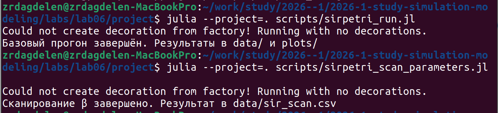
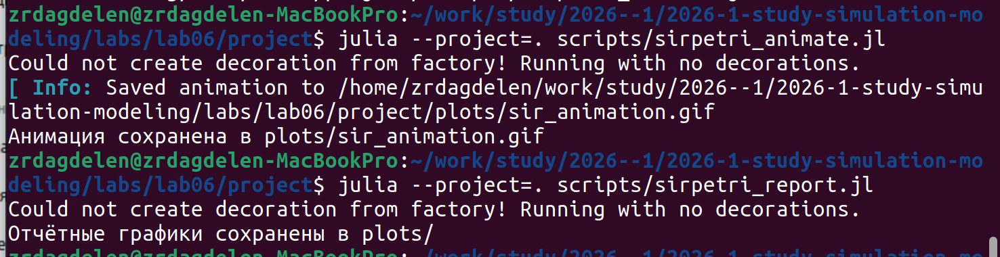
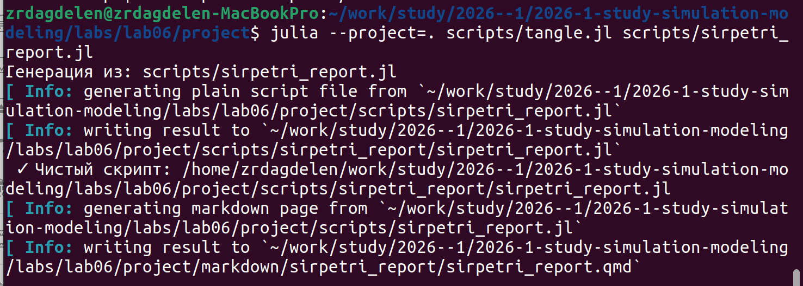
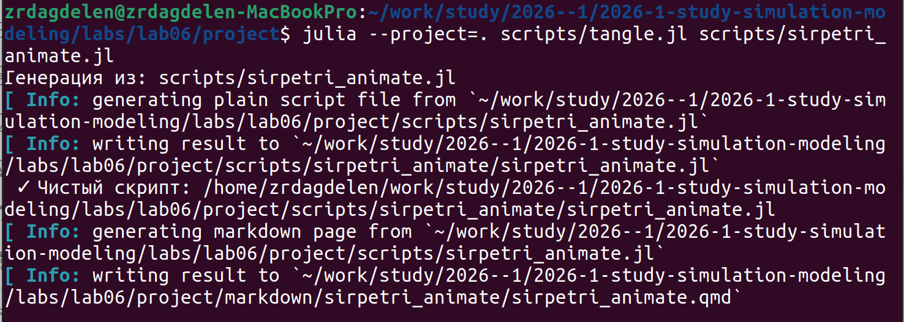
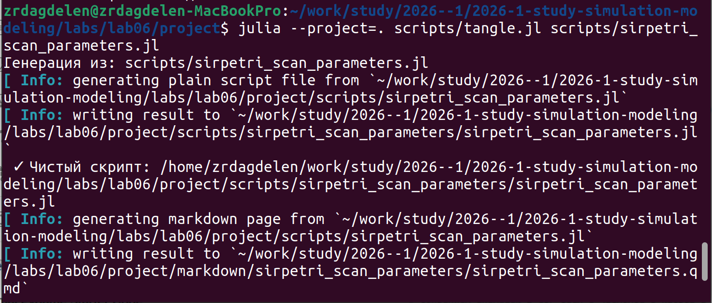
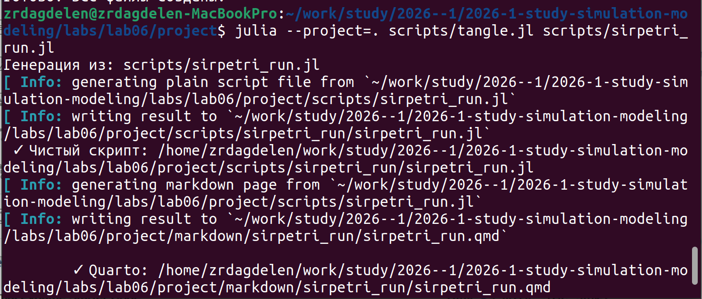

---
## Author
author:
  name: Дагделен Зейнап Реджеповна
  degrees: DSc
  orcid: 0000-0002-0877-7063
  email: 1132236052@rudn.ru
  affiliation:
    - name: Российский университет дружбы народов
      country: Российская Федерация
      postal-code: 117198
      city: Москва
      address: ул. Орджоникидзе, д. 3

## Title
title: "Лабораторная работа №6"
subtitle: "Реализация основных моделей в подходе сетей Петри"
license: "CC BY"
---

# Цель работы

Освоить моделирование эпидемии SIR с помощью сетей Петри в Julia, реализовать детерминированный и стохастический подходы, провести анализ чувствительности модели, а также преобразовать код в литературный стиль с генерацией исполняемых файлов (Jupyter Notebook, Quarto).

# Задание

1. Реализовать модель SIR с использованием размеченной сети Петри.
2. Выполнить базовый расчёт (детерминированный и стохастический) с параметрами $\beta = 0.3$, $\gamma = 0.1$.
3. Провести сканирование параметра $\beta$ ($0.1 : 0.05 : 0.8$) и построить графики $\text{peak}_I(\beta)$ и $\text{final}_R(\beta)$.
4. Создать анимацию динамики S, I, R.
5. Преобразовать код в литературный стиль и сгенерировать:
   - чистый код (`.jl`);
   - Jupyter Notebook (`.ipynb`);
   - документацию Quarto (`.qmd`).
6. Выполнить расчёты для дополнительного набора параметров (например, $\beta = 0.5$, $\gamma = 0.05$) и включить результаты в отчёт.

Ниже приведён структурированный текст для отчёта по лабораторной работе на основе предоставленного файла `lab06.pdf`. Текст включает **цель**, **задание** (адаптированное и дополненное для ясности) и **теоретическое введение** (описание модели SIR и сетей Петри).

# Теоретическое введение

## Модель SIR

Модель SIR является классической эпидемиологической моделью, описывающей распространение инфекционного заболевания в популяции. Вся популяция делится на три группы:

- **S (Susceptible)** – восприимчивые к инфекции особи, которые могут заразиться при контакте с инфицированными.
- **I (Infectious)** – инфицированные особи, способные передавать инфекцию восприимчивым и впоследствии выздоравливать.
- **R (Recovered)** – выздоровевшие особи, приобретающие иммунитет и не участвующие в дальнейшем распространении болезни.

Взаимодействия между группами описываются двумя процессами:

- **Заражение**: $S + I \xrightarrow{\beta} I + I$ – при контакте восприимчивого с инфицированным первый переходит в группу I. Скорость процесса пропорциональна произведению $S \cdot I$ (закон действующих масс) с коэффициентом $\beta$ (эффективность заражения).
- **Выздоровление**: $I \xrightarrow{\gamma} R$ – инфицированный переходит в группу R с постоянной скоростью $\gamma$ (обратная величина среднего времени болезни).

### Детерминированная форма (ОДУ)

В предположении бесконечно большой популяции динамика концентраций описывается системой обыкновенных дифференциальных уравнений:

$$
\begin{cases}
\frac{dS}{dt} = -\beta S I \\[4pt]
\frac{dI}{dt} = \beta S I - \gamma I \\[4pt]
\frac{dR}{dt} = \gamma I
\end{cases}
$$

### Стохастическая форма

При малой численности популяции существенны случайные флуктуации. Стохастическое моделирование использует **прямой метод Гиллеспи** (SSA – Stochastic Simulation Algorithm). На каждом шаге:

- Вычисляются пропускные способности (hazard functions): $a_{\text{inf}} = \beta S I$, $a_{\text{rec}} = \gamma I$.
- Генерируется время до следующего события: $\Delta t = -\ln(r_1) / (a_{\text{inf}} + a_{\text{rec}})$, где $r_1 \sim \text{Uniform}(0,1)$.
- С вероятностью $a_{\text{inf}} / (a_{\text{inf}} + a_{\text{rec}})$ происходит заражение, иначе – выздоровление.
- Состояние обновляется дискретно, и процесс повторяется.

## Сети Петри

**Сеть Петри** – это графовая модель параллельных и асинхронных систем, состоящая из:

- **Позиций (places)** – круги, представляющие состояния (в модели SIR: $S, I, R$).
- **Переходов (transitions)** – прямоугольники, представляющие события (infection, recovery).
- **Дуг (arcs)** – связи от позиций к переходам и обратно, указывающие, сколько фишек изымается или помещается.
- **Фишек (tokens)** – дискретные единицы, распределённые по позициям.

В данной работе используется **размеченная сеть Петри (Labelled Petri Net)**, где переходы имеют метки и связаны с динамическими законами. На основе такой сети автоматически строится система ОДУ (через закон действующих масс) или запускается алгоритм Гиллеспи. Это позволяет унифицировать описание модели для детерминированного и стохастического режимов.

## Используемые численные методы

- **Tsit5** – метод Рунге-Кутты 5-го порядка (реализация из пакета `OrdinaryDiffEq`) для детерминированного интегрирования.
- **Прямой метод Гиллеспи** (Gillespie SSA) – точный алгоритм для стохастического моделирования химических и биологических реакций.

Такой подход демонстрирует переход от макроскопической (гладкой) динамики к микроскопической (флуктуирующей) при уменьшении масштаба системы, что особенно важно для понимания поведения эпидемий в малых популяциях.

# Выполнение лабораторной работы

Создала необходимые файлы, куда скопировала весь код, предоставленный в лабораторной работе.

Запустила их всех, сначала пробежав ```install_packages.jl```, установив необходимые библиотеки ([рис. @fig-001], [рис. @fig-002]).

{#fig-001 width=70%}

{#fig-002 width=70%}

Далее создала литературный код для всех основных файлов. После скомпилировала чистый код, jupiter notebook и quarto с помощью файла с кодом ```tangle.jl``` ([рис. @fig-003], [рис. @fig-004], [рис. @fig-005], [рис. @fig-006]).

{#fig-003 width=70%}

{#fig-004 width=70%}

{#fig-005 width=70%}

{#fig-006 width=70%}

Кад из файлов и анализ результатов предоставлен ниже.









# Вывод

Реализована модель SIR с использованием сетей Петри в детерминированном и стохастическом вариантах. Проведён анализ чувствительности к параметру $\beta$. Метод литературного программирования позволил автоматически генерировать исполняемые файлы и отчёты.

# Список литературы{.unnumbered}

- [Лабораторная №6](https://esystem.rudn.ru/pluginfile.php/3094247/mod_resource/content/3/simulation-modeling-lab.pdf#chapter.6)

::: {#refs}
:::
