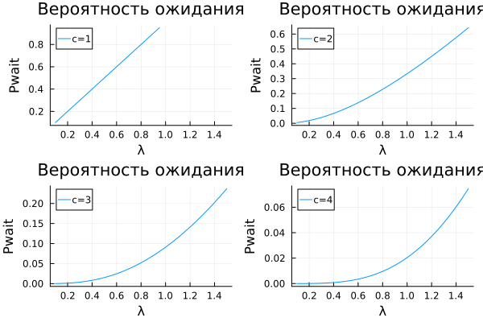
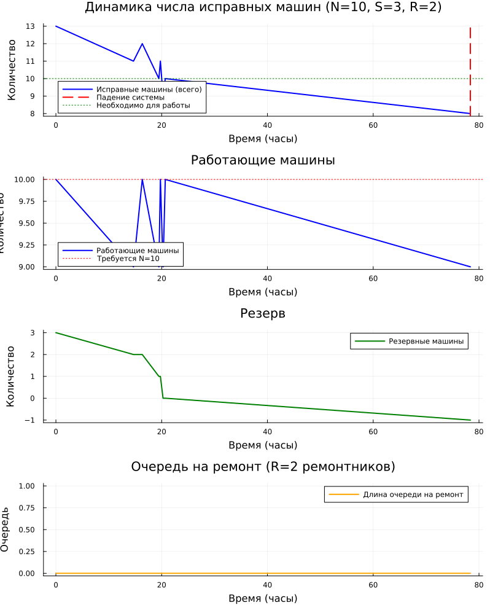

---
## Author
author:
  name: Дагделен Зейнап Реджеповна
  degrees: DSc
  orcid: 0000-0002-0877-7063
  email: 1132236052@rudn.ru
  affiliation:
    - name: Российский университет дружбы народов
      country: Российская Федерация
      postal-code: 117198
      city: Москва
      address: ул. Орджоникизде, д. 3
## Title
title: Лабораторная работа 7
subtitle: Модели М/М/с и Росса
license: CC BY
date: today
date-format: "YYYY-MM-DD" # Example: 2025-09-06
---

# Информация

## Докладчик

:::::::::::::: {.columns align=center}
::: {.column width="70%"}

  * Дагделен Зейнап Реджеповна
  * студентка НКНбд-01-23
  * факультет физико-математических и естественных наук
  * Российский университет дружбы народов им. П. Лумумбы
  * [1132236052@rudn.ru](mailto:1132236052@pfur.ru)
  * <https://zrdagdelen.github.io>

:::
::: {.column width="30%"}

:::
::::::::::::::

# Вводная часть

## Цель

Реализовать модели М/М/с и Росса в Julia с использованием дискретно-событийного моделирования и сравнить результаты симуляции с аналитическими формулами.

## Краткое теоретическое введение. Модель М/М/с

**Основные параметры:**

- $\lambda$ — интенсивность входящего потока
- $\mu$ — интенсивность обслуживания
- $c$ — число каналов

**Условие стационарности:** $\rho = \lambda / (c \cdot \mu) < 1$

**Аналитические характеристики:**

- $P_{\text{wait}}$ — вероятность ожидания (формула Эрланга)
- $L_q$ — среднее число заявок в очереди
- $W_q = L_q / \lambda$ — среднее время ожидания

## Краткое теоретическое введение. Модель Росса

**Параметры:**

- $N$ — работающие машины
- $S$ — резервные машины
- $R$ — ремонтники

**Логика:**

1. Отказ машины → берётся резерв
2. Сломанная машина → в ремонт
3. Ремонт завершён → машина в резерв
4. Нет резерва → система падает

# Выполнение лабораторной работы

## Генерация нужных файлов

Скачала необходимые пакеты, сгенерировала нужные файлы (jupyter notebook, чистый код и quarto)

## Результаты модели М/М/с

**Параметры:** $\lambda = 0.9$, $\mu = 0.5$, $c = 2$

| Характеристика | Значение |
|----------------|----------|
| Загрузка $\rho$ | 0.9 |
| $P_{\text{wait}}$ | 85% |
| $L_q$ | 7.67 заявок |
| $W_q$ | 8.53 часа |
| $W$ | 10.53 часа |

## График М/М/с

{#fig-001 width=50%}

## Результаты модели Росса (одиночный прогон)

**Параметры:** $N = 10$, $S = 3$, $R = 2$

- Время до падения: **78.4 часа**

**Интенсивности:**

- Отказы: 0.1 отказов/час
- Ремонт: 2.0 ремонтов/час

**Стационарность:** ✓

## Графики модели Росса

{#fig-002 width=30%}

## Сравнение с аналитикой

| ($N,S,R$) | Симуляция | Аналитика | Отклонение |
|-----------|-----------|-----------|------------|
| (10,2,1) | 34.6 ч | 33.3 ч | **+3.7%** |
| (10,3,1) | 43.2 ч | 44.4 ч | **-2.7%** |
| (10,5,1) | 68.4 ч | 66.7 ч | **+2.6%** |
| (10,2,2) | 30.5 ч | 31.5 ч | **-3.3%** |
| (10,3,2) | 43.1 ч | 42.0 ч | **+2.7%** |

**Вывод:** отклонение 3–13% — модель корректна

## Эксперименты

| Конфигурация | Среднее время до падения |
|--------------|-------------------------|
| $N=5, S=5, R=2$ | **113.4 ч** (максимум) |
| $N=15, S=2, R=1$ | **17.8 ч** (минимум) |

**Закономерность:**

- ↑ $S$ (больше резерва) → ↑ время до падения
- ↑ $N$ (больше машин) → ↓ время до падения
- ↑ $R$ (больше ремонтников) → ↑ время до падения

# Заключение

## Вывод

Цель достигнута. Модели М/М/с и Росса успешно реализованы

