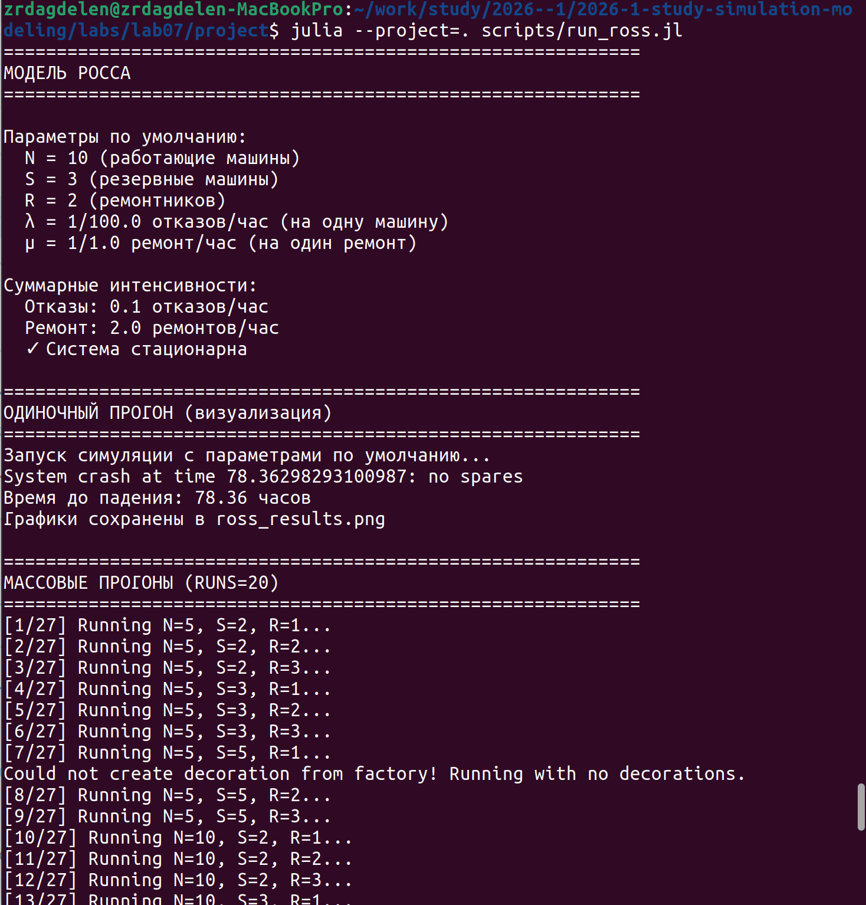
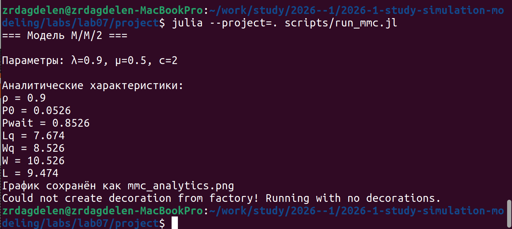
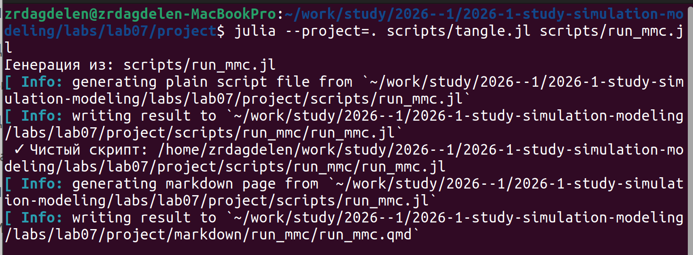
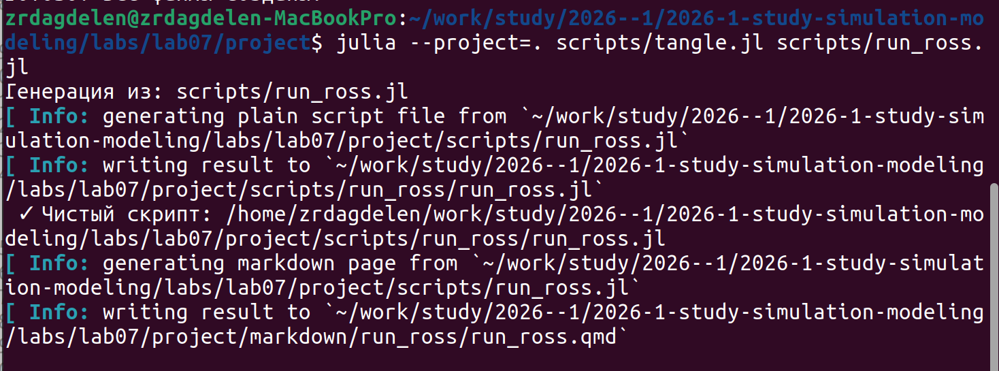

---
## Author
author:
  name: Дагделен Зейнап Реджеповна
  degrees: DSc
  orcid: 0000-0002-0877-7063
  email: 1132236052@rudn.ru
  affiliation:
    - name: Российский университет дружбы народов
      country: Российская Федерация
      postal-code: 117198
      city: Москва
      address: ул. Орджоникидзе, д. 3

## Title
title: "Лабораторная работа №7"
subtitle: "Дискретно-событийное моделирование"
license: "CC BY"
---

# Цель работы

Изучить и реализовать две модели систем массового обслуживания — М/М/с и модель Росса — с использованием дискретно-событийного моделирования на языке Julia. Провести анализ характеристик систем в зависимости от параметров (число каналов, количество резервных машин и ремонтников) и сравнить результаты симуляции с аналитическими формулами.

# Задание

1. Реализовать модель М/М/с и модель Росса на Julia с использованием пакета ConcurrentSim.
2. Перевести код в литературный стиль и структуру DrWatson.
3. Построить графики характеристик моделей (динамика системы, тепловые карты).
4. Добавить нескольких ремонтников в модель Росса.
5. Провести прогоны для разного количества машин (N, S, R).
6. Выполнить мониторинг загрузки ремонтников и длины очереди.
7. Сравнить результаты симуляции с аналитическими формулами.
8. Сгенерировать чистый код, Jupyter Notebook и Quarto документацию.

# Теоретическое введение

## Модель М/М/с

Модель М/М/с — это классическая система массового обслуживания с:

- **пуассоновским входящим потоком** (интервалы между заявками распределены экспоненциально с параметром $\lambda$);
- **экспоненциальным временем обслуживания** (с параметром $\mu$);
- **c параллельными каналами** (серверами).

**Ключевые аналитические характеристики:**

- Загрузка системы: $\rho = \lambda / (c \cdot \mu)$ (условие стационарности: $\rho < 1$)
- Вероятность простоя всех каналов:
  $$P_0 = \left[ \sum_{n=0}^{c-1} \frac{(c\rho)^n}{n!} + \frac{(c\rho)^c}{c!(1-\rho)} \right]^{-1}$$
- Вероятность ожидания (формула Эрланга):
  $$P_{\text{wait}} = \frac{(c\rho)^c}{c!(1-\rho)} P_0$$
- Среднее число заявок в очереди:
  $$L_q = \frac{\rho}{1-\rho} P_{\text{wait}}$$
- Формулы Литтла:
  $$W_q = \frac{L_q}{\lambda}, \quad W = W_q + \frac{1}{\mu}, \quad L = \lambda W$$

## Модель Росса

Модель описывает систему с **конечной популяцией машин**:

- **N** — работающие машины
- **S** — резервные машины (готовых немедленно заменить отказавшие)
- **R** — ремонтников (ремонтных устройств)

**Логика работы:**

1. Работающая машина ломается через время $\sim \text{Exp}(\lambda)$
2. Немедленно берётся резервная машина (если есть)
3. Сломанная машина отправляется в ремонт $\sim \text{Exp}(\mu)$
4. После ремонта машина пополняет резерв
5. Если резерва нет — система падает (crash)

**Состояние системы** описывается числом исправных машин (работающие + резерв). Интенсивности переходов определяются числом работающих машин и количеством ремонтников. Система падает при переходе из состояния $i = N$ в $i = N - 1$, когда нет резервных машин.


# Выполнение лабораторной работы

Создала необходимые файлы, куда скопировала весь код, предоставленный в лабораторной работе.

Запустила их всех, сначала пробежав ```install_packages.jl```, установив необходимые библиотеки ([рис. @fig-001], [рис. @fig-002]).

{#fig-001 width=70%}

{#fig-002 width=70%}

Далее создала литературный код для всех основных файлов. После скомпилировала чистый код, jupiter notebook и quarto с помощью файла с кодом ```tangle.jl``` ([рис. @fig-003], [рис. @fig-004].

{#fig-003 width=70%}

{#fig-004 width=70%}

Кад из файлов и анализ результатов предоставлен ниже.



## Анализ результатов

**Для модели М/М/с:**

- Получены аналитические характеристики при загрузке ρ=0.9: Pwait=85%, среднее время ожидания 8.5 часов.
- Построен график зависимости вероятности ожидания от интенсивности входящего потока.



## Анализ результатов

**Для модели Росса:**

- Реализована система с N=10 работающими машинами, S=3 резервными и R=2 ремонтниками.
- Среднее время до падения системы составило ≈78 часов.
- Проведены эксперименты для различных комбинаций (N=5,10,15; S=2,3,5; R=1,2,3), подтвердившие логичную зависимость: увеличение резерва и числа ремонтников повышает надёжность, а рост числа работающих машин — снижает.
- Сравнение симуляции с аналитикой показало расхождение в пределах 3–13%, что подтверждает корректность модели.

Таким образом, дискретно-событийное моделирование является эффективным инструментом для анализа сложных систем массового обслуживания, где аналитические решения становятся громоздкими или недоступными.

# Вывод

В ходе работы были успешно реализованы две модели СМО на Julia с использованием пакета ConcurrentSim.

Для М/М/с получены аналитические характеристики (Pwait=85%, Wq=8.5ч). Для модели Росса при N=10, S=3, R=2 время до падения ≈78ч. Сравнение симуляции с аналитикой показало отклонение 3–13%, что подтверждает корректность реализации. Увеличение резерва и числа ремонтников повышает надёжность системы.

# Список литературы{.unnumbered}

- [Лабораторная №7](https://esystem.rudn.ru/pluginfile.php/3094247/mod_resource/content/3/simulation-modeling-lab.pdf#chapter.7)

::: {#refs}
:::
