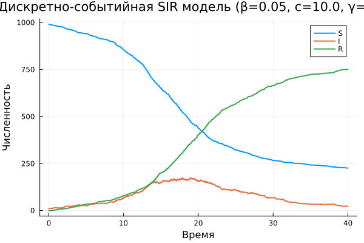
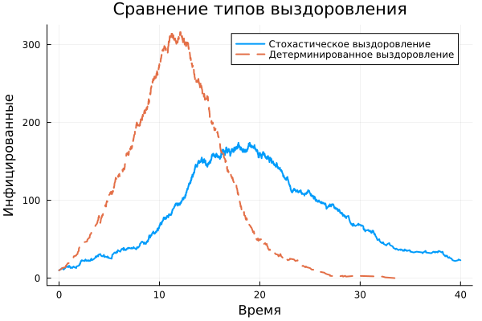

---
## Author
author:
  name: Дагделен Зейнап Реджеповна
  degrees: DSc
  orcid: 0000-0002-0877-7063
  email: 1132236052@rudn.ru
  affiliation:
    - name: Российский университет дружбы народов
      country: Российская Федерация
      postal-code: 117198
      city: Москва
      address: ул. Орджоникизде, д. 3
## Title
title: Лабораторная работа 8
subtitle: Дискретно-событийное моделирование распространения инфекции (SIR-модель)
license: CC BY
date: today
date-format: "YYYY-MM-DD" # Example: 2025-09-06
---

# Информация

## Докладчик

:::::::::::::: {.columns align=center}
::: {.column width="70%"}

  * Дагделен Зейнап Реджеповна
  * студентка НКНбд-01-23
  * факультет физико-математических и естественных наук
  * Российский университет дружбы народов им. П. Лумумбы
  * [1132236052@rudn.ru](mailto:1132236052@pfur.ru)
  * <https://zrdagdelen.github.io>

:::
::: {.column width="30%"}

:::
::::::::::::::

# Введение и теория

## Цель работы

- Изучить дискретно-событийный подход к имитационному моделированию
- Реализовать стохастическую SIR-модель на языке Julia
- Провести анализ влияния параметров модели
- Сравнить стохастическую и детерминированную версии

## Что такое SIR-модель?

**SIR** – классическая эпидемиологическая модель:

| Символ | Состояние | Описание |
|--------|-----------|----------|
| **S** | Susceptible | Восприимчивые к заболеванию |
| **I** | Infected | Инфицированные и заразные |
| **R** | Recovered | Переболевшие (выздоровевшие) |

## Параметры модели и R₀

| Параметр | Значение | Смысл |
|----------|----------|-------|
| $\beta$ | 0.05 | Вероятность заражения при контакте |
| $c$ | 10.0 | Частота контактов (1/время) |
| $\gamma$ | 0.25 | Интенсивность выздоровления |

**Базовое репродуктивное число:**

- $R_0 > 1$ → эпидемия распространяется
- $R_0 < 1$ → эпидемия затухает

## Дискретно-событийный подход (DES)

**Особенности:**

- Время продвигается от события к событию
- Агенты действуют независимо (конкурентно)
- Случайные интервалы времени (экспоненциальное распределение)

**События в модели:**

1. Контакт между индивидами
2. Заражение (с вероятностью $\beta$)
3. Выздоровление (через случайное время)

# Выполнение лабораторной

## Результаты – базовый запуск

{#fig-001 width=70%}

## Анализ чувствительности – варьирование $\beta$ 

| β | Пик I | Время пика | Переболело |
|---|-------|------------|-------------|
| 0.03 | 24 | 37.9 | 116 |
| 0.05 | 174 | 17.9 | 751 |
| 0.07 | 264 | 12.3 | 924 |

**Вывод:** Чем выше β, тем быстрее и сильнее эпидемия.

## Анализ чувствительности – варьирование  $с$  и  $\gamma$ 

**Варьирование $с$:**

| c | Пик I | Переболело |
|---|-------|-------------|
| 5 | 21 | 82 |
| 10 | 174 | 751 |
| 15 | 293 | 924 |

**Варьирование $\gamma$:**

| γ | Пик I | Переболело |
|---|-------|-------------|
| 0.15 | 376 | 941 |
| 0.25 | 174 | 751 |
| 0.35 | 109 | 576 |

## Сравнение версий (стохастическая vs детерминированная)

{#fig-002 width=70%}

## Производительность

**Характеристики модели:**

- Популяция: **10 000** индивидов
- Время создания модели: **≈ 0.02 секунды**
- Симуляция: выполняется быстро благодаря DES подходу

**Преимущества DES:**

- Нет фиксированного шага по времени
- Обрабатываются только моменты событий
- Эффективно для разреженных событий

## Выводы

1. **Чувствительность к параметрам:**

   - ↑ $\beta$ или ↑ $c$ → ↑ пик $I$, ↓ время пика
   - ↑ $\gamma$ → ↓ пик $I$

2. **Сравнение версий:**

   - Детерминированная → гладкая кривая
   - Стохастическая → реалистична для малых популяций

3. **Модель работоспособна** и пригодна для имитации эпидемий

4. **$R_0$ = 2.0** → эпидемия распространяется (подтверждено)

# Заключение

В результате работы реализована дискретно-событийная SIR-модель на Julia. Проведён анализ чувствительности к параметрам $\beta$, $c$, $\gamma$, сравнение стохастической и детерминированной версий, оценка производительности. Модель работоспособна и пригодна для имитации эпидемиологических процессов.

