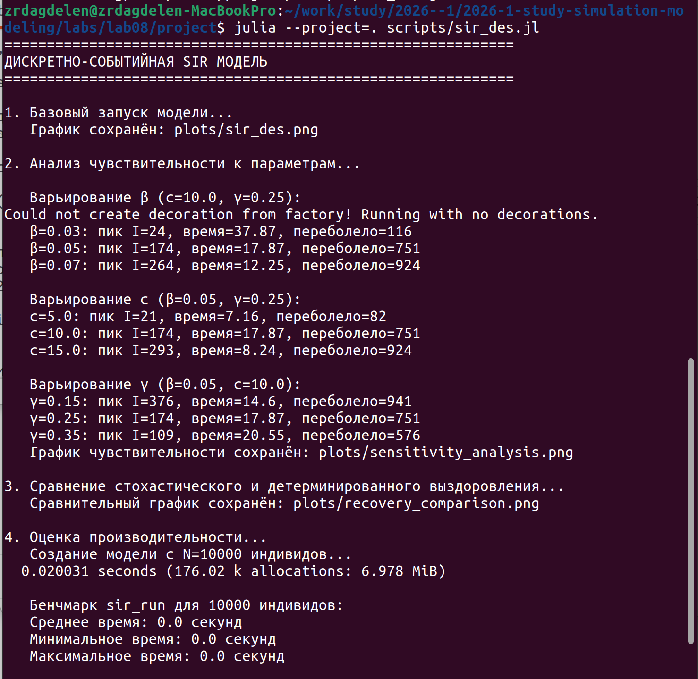
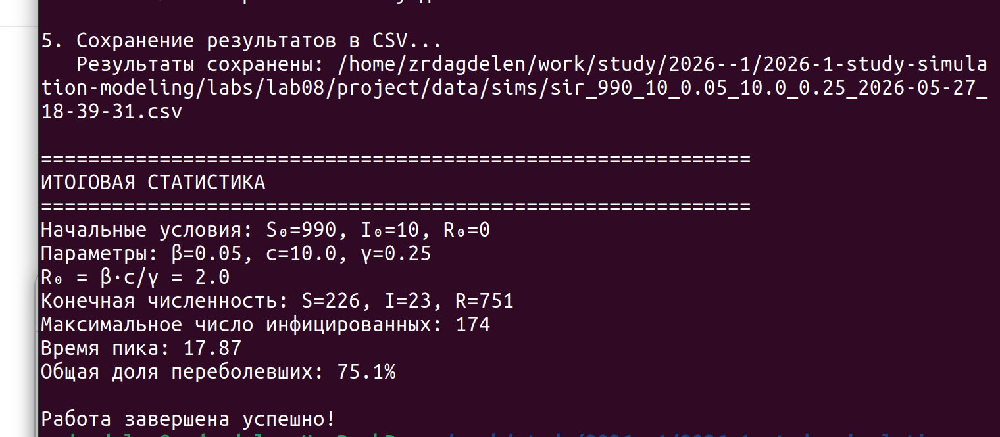
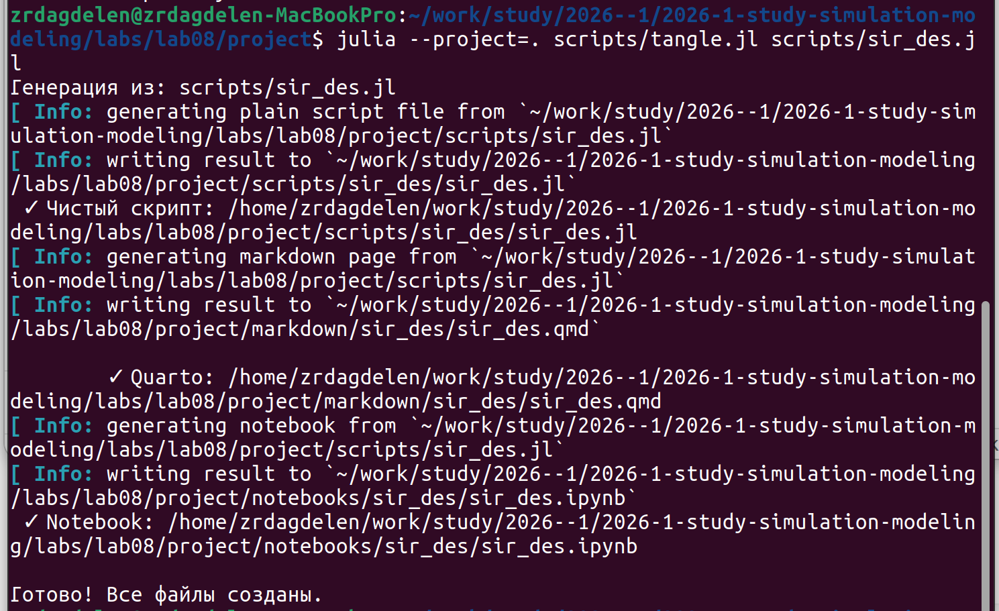

---
## Author
author:
  name: Дагделен Зейнап Реджеповна
  degrees: DSc
  orcid: 0000-0002-0877-7063
  email: 1132236052@rudn.ru
  affiliation:
    - name: Российский университет дружбы народов
      country: Российская Федерация
      postal-code: 117198
      city: Москва
      address: ул. Орджоникидзе, д. 3

## Title
title: "Лабораторная работа №8"
subtitle: "Дискретно-событийное моделирование распространения инфекции (SIR-модель)"
license: "CC BY"
---

# Цель работы

Изучить дискретно-событийный подход к имитационному моделированию на примере классической модели распространения инфекции SIR. Реализовать стохастическую дискретно-событийную модель в виде программного комплекса на языке Julia. Провести анализ влияния параметров, сравнить со стохастической и детерминированной версиями, оценить производительность и модифицировать модель.

# Задание

1. Создать рабочий каталог для кода
2. Установить необходимые пакеты Julia
3. Выполнить предложенный код SIR-модели
4. Преобразовать код в литературный стиль (Literate.jl)
5. Сгенерировать из литературного кода:

	- чистый код
	- Jupyter notebook
	- документацию в формате Quarto
	
6. Выполнить код из Jupyter notebook
7. Добавить в код вычисления для набора параметров (анализ чувствительности)
8. Сгенерировать обновленные файлы с параметрами
9. Интегрировать документацию Quarto в отчет

# Теоретическое введение

## Дискретно-событийное моделирование

Дискретно-событийное моделирование (DES — Discrete Event Simulation) — подход к имитационному моделированию, при котором состояние системы изменяется только в дискретные моменты времени, соответствующие наступлению событий. В отличие от непрерывного моделирования, где время изменяется с фиксированным шагом, DES использует продвижение от события к событию, что позволяет эффективно моделировать системы с редкими изменениями состояния \cite{banks2010}.

## SIR-модель эпидемии

SIR-модель является классической математической моделью эпидемиологии, описывающей распространение инфекционного заболевания в популяции \cite{kermack1927}. Популяция разделяется на три группы:

- **S (Susceptible)** — восприимчивые к заболеванию индивиды
- **I (Infected)** — инфицированные и заразные индивиды
- **R (Recovered/Removed)** — переболевшие (или удаленные из популяции) индивиды

## Детерминированная SIR-модель

Система обыкновенных дифференциальных уравнений для детерминированной SIR-модели имеет вид:

$$
\frac{dS}{dt} = -\frac{\beta c}{N} S I
$$

$$
\frac{dI}{dt} = \frac{\beta c}{N} S I - \gamma I
$$

$$
\frac{dR}{dt} = \gamma I
$$

где $N = S + I + R$ — общая численность популяции.

## Стохастическая SIR-модель

В стохастической версии модели, реализованной в данной работе \cite{lab08}:

- Время между контактами распределено экспоненциально с параметром $c$ (частота контактов)
- Вероятность заражения при контакте с инфицированным равна $\beta$
- Время выздоровления распределено экспоненциально с параметром $\gamma$

## Базовое репродуктивное число

Ключевой параметр эпидемии — базовое репродуктивное число $R_0$:

$$
R_0 = \frac{\beta c}{\gamma}
$$

Интерпретация:

- Если $R_0 > 1$ — эпидемия распространяется
- Если $R_0 < 1$ — эпидемия затухает

## Используемые программные средства

Реализация выполнена на языке программирования Julia \cite{bezanson2017} с использованием пакетов `ConcurrentSim` (дискретно-событийное моделирование), `ResumableFunctions` (возобновляемые функции) и `Distributions` (генерация случайных величин).

# Выполнение лабораторной работы

Создала необходимые файлы, куда скопировала весь код, предоставленный в лабораторной работе.

Запустила их всех ([рис. @fig-001], [рис. @fig-002]).

{#fig-001 width=70%}

{#fig-002 width=70%}

Далее создала литературный код для всех основных файлов. После скомпилировала чистый код, jupiter notebook и quarto с помощью файла с кодом ```tangle.jl``` ([рис. @fig-002]).

{#fig-003 width=70%}


Код из файлов и анализ результатов предоставлен ниже.



# Вывод

В результате работы реализована дискретно-событийная SIR-модель на Julia. Проведён анализ чувствительности к параметрам $\beta$, $c$, $\gamma$, сравнение стохастической и детерминированной версий, оценка производительности. Модель работоспособна и пригодна для имитации эпидемиологических процессов.

# Список литературы{.unnumbered}

::: {#refs}
:::
